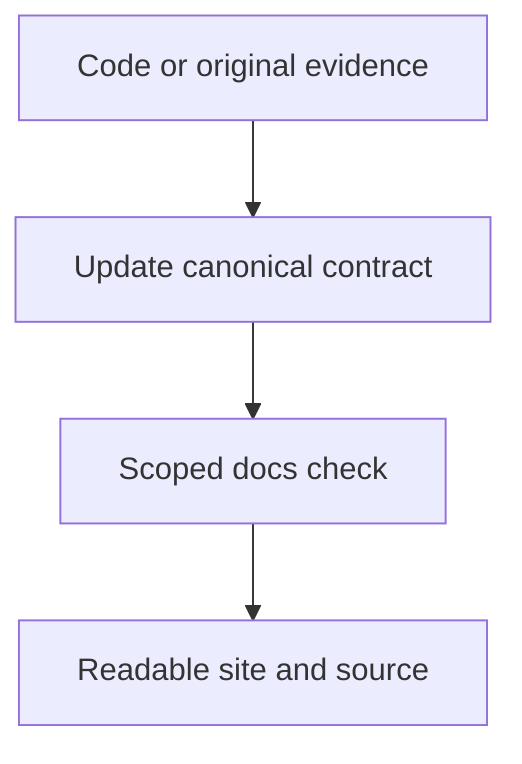

# Maintain these docs

`docs/` is the source of truth. Keep the current contract easy to find, link the implementation, and record uncertainty where it matters. Root `README.md` and `AGENTS.md` stay short navigation entry points.

## Where information belongs

| Information                                | Canonical page                                                                   | Avoid duplicating                            |
| ------------------------------------------ | -------------------------------------------------------------------------------- | -------------------------------------------- |
| Run commands, controls and code map        | [Client setup](README.md)                                                        | Server environment and release checklists    |
| Quick Start, database, accounts, deployment | [Server Quick Start](server/index.md)                                                  | Protocol payload specifications              |
| Shared owners, clock and commit boundaries | [Integration contract](reconstruction-contract.md)                               | Full schema dumps maintained elsewhere       |
| Current online feature owners and gaps     | [Feature coverage](server/offline-parity.md)                                     | Old correction narratives                    |
| Exact original behavior and provenance     | Domain evidence page, e.g. [movement](physics-evidence.md) or [UI](ingame-ui.md) | Unlabeled emulator policy or inference       |
| How to validate                            | [Validation method](validation-method.md)                                        | Claims that a check passed                   |
| What was actually exercised                | [Validation index](validation.md) and source-identified report                   | Treating historical counts as current totals |
| Earlier builds, failures and measurements  | [Archive](archive/index.md)                                                      | Current navigation/search results            |

The former offline integration page now points to the shared contract. Client setup no longer repeats site maintenance or all validation commands. The feature inventory consolidates overlapping native-surface tables. Earlier validation/gameplay/UI narratives live in the archive, with their original evidence intact.

## Write for humans and agents

| Prefer                                                          | Why                                                                   |
| --------------------------------------------------------------- | --------------------------------------------------------------------- |
| One short explanation, then a comparison or ownership table     | Readers can locate the decision without parsing a long incident log.  |
| Exact code paths, exports, units and source addresses           | Agents can recover the implementation and provenance.                 |
| A diagram for state ownership or a multi-stage transaction      | Makes boundaries and ordering visible.                                |
| A linked report with source/catalog identity                    | Keeps implementation and measured proof separate.                     |
| A collapsed detail block for long derivations or legacy context | Preserves useful evidence without overwhelming the main guide.        |
| Explicit unsupported behavior                                   | Asset presence or a handler name does not imply feature completeness. |

Keep one canonical page per contract. Link to a more detailed page instead of copying a paragraph that will drift. Update an existing contract when behavior changes; retain historical measurements with their original identities. Do not delete raw evidence merely because an older guide is superseded.

## Site and diagrams

The site uses pinned VitePress, Vue and Mermaid packages from `bun.lock`. It builds without original game assets. No diagram CDN or hosted renderer is used.

```sh
bun run dev:docs
bun run docs:check
bun run docs:build
bun run docs:preview
```

Development defaults to port 5173 and preview to 4173. Generated output/cache stays under `docs/.vitepress/`. Navigation has one level of topic groups with decorative SVG icons and readable labels. The content supports the project's desktop minimum of 800 × 600.

Write ordinary Mermaid fences. Each renders as SVG after page load, updates with light/dark theme and offers **Diagram source**. Server-rendered content keeps the source available before JavaScript loads; rendering failure exposes a readable error and source.



[Mermaid's render API](https://mermaid.js.org/config/usage) runs with strict security, disabled HTML flowchart labels, a 20,000-character/200-edge bound and a serialized theme-owned render queue. [Local search](https://vitepress.dev/reference/default-theme-search) excludes pages with `search: false`; archives and compatibility pages use this flag. Diagram sources remain plain Markdown for Git readers and agents.

### Routes and links

| Source                 | Published route  |
| ---------------------- | ---------------- |
| `docs/index.md`        | `/`              |
| `docs/README.md`       | `/client/`       |
| Other top-level guides | `/client/<name>` |
| `docs/server/`         | `/server/`       |
| `docs/archive/`        | `/archive/`      |

Use source-relative Markdown links in prose and canonical routes in navigation. The [resolver](.vitepress/repository-links.js) converts source links to site routes, checks raw file targets and points repository evidence to `tensorfish/openms`. Embedded images remain local assets. Missing link targets fail validation/build; do not disable dead-link checking.

## Audit and validation

`bun run docs:check` scans every Markdown page and the sidebar, checks local targets and fragments, and reports profile/protocol/package facts directly from code. Work and file sizes are bounded. It does not start the game, extract assets or certify gameplay. The existing `bun docs/tools/online-feature-audit.js` checks native hooks and declared action wiring; use it when changing the coverage inventory.

| Change                             | Smallest appropriate check                                                                   |
| ---------------------------------- | -------------------------------------------------------------------------------------------- |
| Prose or links                     | Review affected content; run the docs link audit when links/routes changed.                  |
| Sidebar, theme or Mermaid renderer | Scoped formatting/lint, docs audit/build, inspect the changed surface in a browser.          |
| Gameplay contract                  | Affected implementation test; see [validation scope](validation-method.md#validation-scope). |
| Historical evidence                | Preserve source identities and relative asset links; exclude it from current search.         |

The September 2026 cleanup checked runtime entry points, bootstrap accounts/origins, profile schema, movement preparation, online native hooks, action declarations, source-link targets and site routes. It removed obsolete dice-flow, schema, account-example and narrow skill-whitelist claims from current guides. This is a documentation/code inventory, not a fresh replay of every game feature.
