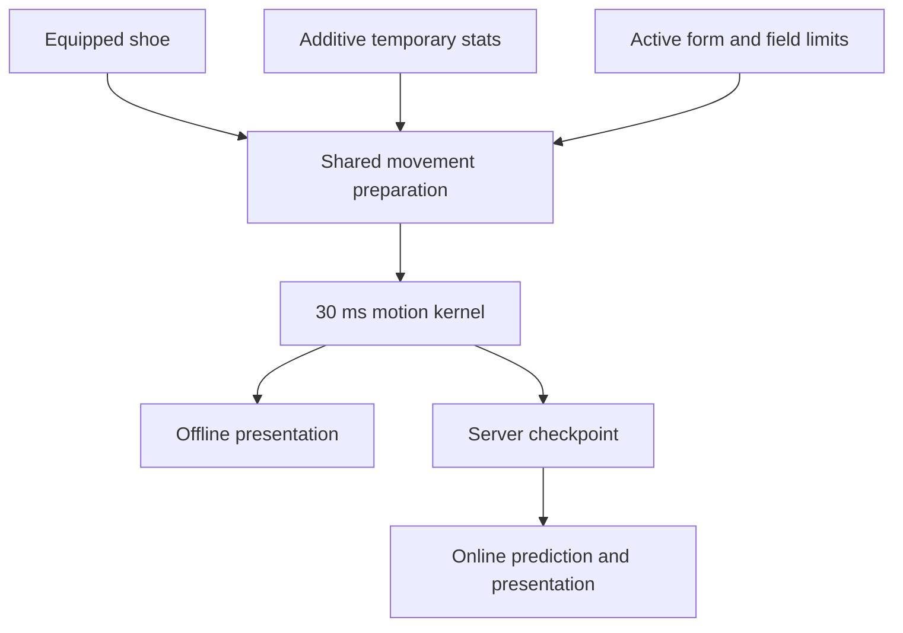

# Online movement parity

Online and offline use the same original-data movement preparation and **30 ms** simulation step. This repair changes server coefficients; it does not change the offline clock or add interpolation to the physics kernel.

## Cause and correction

The server previously passed `projectCharacterStats()` display totals into `updateSkillMovement()`. That function expects additive temporary bonuses. A normal displayed **100%** became **100 base + 100 bonus**, hitting the speed/jump caps of **140% / 123%**.

| Input or coefficient     | Correct meaning                                          | Owner                         |
| ------------------------ | -------------------------------------------------------- | ----------------------------- |
| Display speed/jump `100` | Total percentage shown by Stat                           | `projectCharacterStats`       |
| Derived speed/jump `0`   | No temporary bonus                                       | `SkillSystem.derived()`       |
| `walkSpeed` at 100%      | 125 world pixels/s                                       | Original Physics.img globals  |
| `jumpSpeed` at 100%      | 555 world pixels/s before gravity                        | Original Physics.img globals  |
| First grounded jump tick | `y = −16.75`, `vy = −495` on the flat regression fixture | Recovered 30 ms integration   |
| Normal upper caps        | Speed 140%, jump 123%                                    | Original normal-player branch |

`updatePlayerMovement(sim, equipment, items, derived)` now serves both offline `updateMovement()` and server `moveActor()`. It first resolves the real shoe's friction/swimming properties, then applies cached temporary skill bonuses and active form rules from original base coefficients. Recasts/cancellation cannot compound an earlier multiplier. The server keeps display/combat totals for their existing consumers.



The online browser restores the authoritative coefficients in motion checkpoints. It never submits its own speed, jump height or position as an authoritative result. The shared helper preserves the current offline equipment/buff semantics; it does not expand the set of supported movement controllers.

## Source evidence

| Evidence                            | Location                                                                                              |
| ----------------------------------- | ----------------------------------------------------------------------------------------------------- |
| Original globals and motion quantum | [Decoded WZ globals](ghidra-physics-motion/wz-globals.json) · [Physics evidence](physics-evidence.md) |
| Normal movement and caps            | Native `0094d8f1..0094d9be`                                                                           |
| Form and shoe coefficients          | Native `0094d3d9`, `005cac3d`, `0094da00`                                                             |
| Field-limit override                | Native `0094d311`                                                                                     |
| Shared implementation               | [skill-movement.js](../client/src/physics/skill-movement.js)                                          |
| Offline / online call sites         | [ingame.js](../client/src/ingame.js) · [world.js](../server/src/world.js)                             |
| Wire continuation                   | [motion.js](../shared/motion.js) · [Protocol checkpoints](server/protocol.md#motion-checkpoints)      |

## Scoped verification

```sh
bun test server/test/movement-parity.test.js client/test/sync-alignment.test.js client/test/physics.test.js
```

**33 tests, 795 assertions passed** on the repaired source. The new regression invokes the real `OnlineWorld.moveActor` path and compares every walking/jumping tick with offline preparation and integration. It covers 100%, buff replacement/cancellation, shoe friction/swimming coefficients, anti-slip shoes, riding forms, restricted fields, and received checkpoint continuation. The existing tests cover replay, presentation isolation, refresh partitioning and motion boundaries.

Geometry and buff inputs are explicit isolating fixtures; original globals are independently decoded. This is executable kernel/server parity proof, not a new Windows capture or a network-latency benchmark. Restart both development commands after this runtime change so rules identities match.
