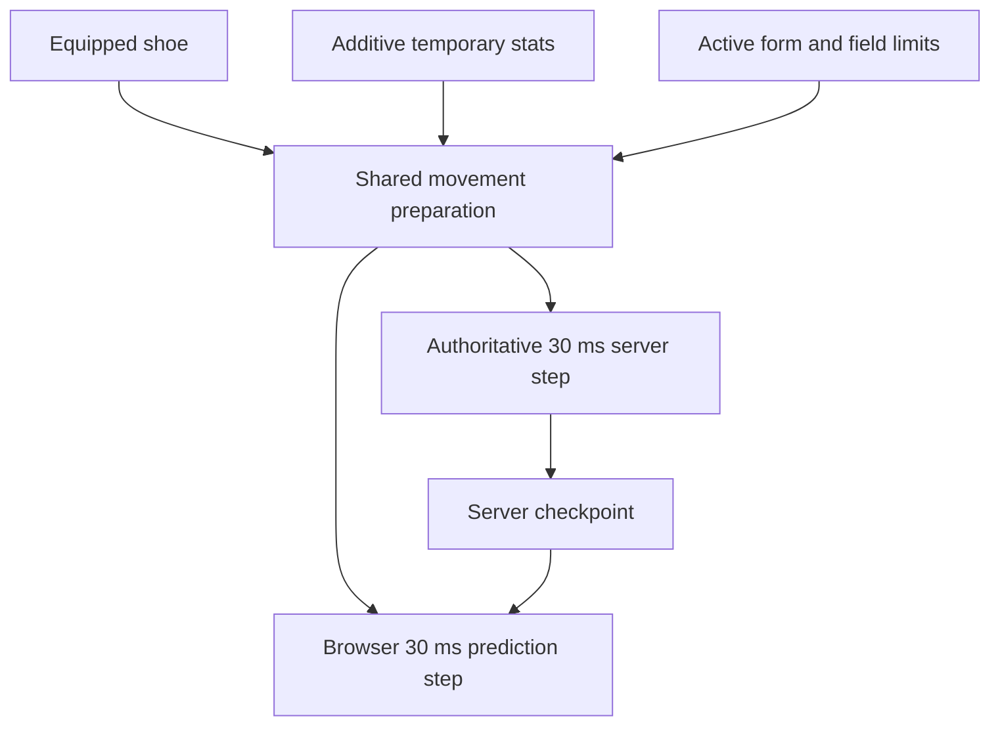

# Online movement parity

The online client and server use the same original-data movement preparation and **30 ms** simulation step. This repair changes server coefficients without changing the fixed-step clock or adding interpolation to the physics kernel.

## Cause and correction

The server previously passed `projectCharacterStats()` display totals into `updateSkillMovement()`. That function expects additive temporary bonuses. A normal displayed **100%** became **100 base + 100 bonus**, hitting the speed/jump caps of **140% / 123%**.

| Input or coefficient     | Correct meaning                                          | Owner                         |
| ------------------------ | -------------------------------------------------------- | ----------------------------- |
| Display speed/jump `100` | Total percentage shown by Stat                           | `projectCharacterStats`       |
| Derived speed/jump `0`   | No temporary bonus                                       | `SkillSystem.derived()`       |
| `walkSpeed` at 100%      | 125 world pixels/s                                       | Original Physics.img globals  |
| `jumpSpeed` at 100%      | 555 world pixels/s before gravity                        | Original Physics.img globals  |
| First grounded jump tick | `y = −16.75`, `vy = −495` on the flat regression fixture | Recovered 30 ms integration   |
| Normal upper caps        | Speed 140%, jump 123%                                    | Original normal-player branch |

`updatePlayerMovement(sim, equipment, items, derived)` is the shared movement kernel used by the authoritative server and browser prediction. It first resolves the real shoe's friction/swimming properties, then applies cached temporary skill bonuses and active form rules from original base coefficients. Recasts/cancellation cannot compound an earlier multiplier. The server keeps display/combat totals for their existing consumers.



The browser restores authoritative coefficients from motion checkpoints. Its own motion is the source of truth for its position unless the server owns the transition (see [client-owned motion](#client-owned-motion)) and a watchdog refutes it. The shared helper preserves equipment and buff semantics without expanding the set of supported movement controllers.

## Client-owned motion

Product priority: the browser is the source of truth for the character's own XY, and the
authority never corrects an ordinary trajectory. A movement skill, a midair mob hit or a
knockback must not produce a visible stall, snap or rubber-band, so the client applies
its own impulses and the server only observes. This also removes the round trip that made
mid-air skill use feel laggy when the client was connected but not when it ran offline.

| Contract                           | Owner                                                                                                              | Behaviour                                                                                                                                                                                                                                                                                                                                                                         |
| ---------------------------------- | ------------------------------------------------------------------------------------------------------------------ | --------------------------------------------------------------------------------------------------------------------------------------------------------------------------------------------------------------------------------------------------------------------------------------------------------------------------------------------------------------------------------- |
| `input.motion` (`x`,`y`,`vx`,`vy`) | `OnlinePrediction.predict` → `OnlineWorld.input`                                                                   | Each input sample reports the state it extends (end of `targetTick - 1`), bounded to the same ±1048576 range as a checkpoint. `Transport.neutral` heartbeats omit it.                                                                                                                                                                                                             |
| Adoption                           | `adoptReportedMotion` in [world.js](../server/src/world.js) · [Contact adoption](../server/src/motion-adoption.js) | Ordinary reports become the server's tick base after watchdog review; the server keeps its own state only while it owns the position (see below). Ground contact must contain the reported point and tangent velocity. Stale foothold/ladder references are released, and matching ground uses the kernel's `009b1553` attachment.                                                |
| Server-owned checkpoints           | `serverOwnsPosition` in [motion-authority.js](../server/src/motion-authority.js)                                   | The published `motion` frame carries `authoritative: true` only for a pending field transition, death, an authored seat, or a movement skill the browser does not simulate (teleport, rush/assault, dash, wings) — `SkillWorldController.ownsMotion`. Only those frames replace the client's kernel.                                                                              |
| Ordinary checkpoints               | `OnlinePrediction.adoptControls`                                                                                   | A frame with `authoritative: false` updates timing, acknowledgement and server-owned _controls_ — `effectiveSettings` (buff/shoe/form speeds), `worldMovement`, `movementLocked` and `seat` — but never `x`/`y`/`vx`/`vy`. The drawn pose is untouched, so no correction glide can stall the player.                                                                              |
| Impulses                           | `motion.diverts[]` in [protocol.js](../shared/protocol.js)                                                         | A server-owned impulse (mob knockback or a movement skill) is published with its exact `{vx, vy}`, its `source` and its `skillId`. The client merges the vector into its **current** kernel state through the same `applyExternalImpulse` entry point, so the trajectory is the original one; it is never restored from a pre-impulse checkpoint.                                 |
| Optimistic movement skills         | `OnlinePrediction.beginOptimistic`                                                                                 | A predicted `impulse` skill is merged at the key press. The matching `source: "skill"` divert is retired by `skillId` and not merged twice. A refused cast calls `rejectOptimistic`, restoring the exact pre-cast checkpoint so an unadmitted impulse cannot survive.                                                                                                             |
| Watchdog                           | [watchdog.js](../server/src/watchdog.js)                                                                           | The authority records motion the kernel cannot explain and judges it against `MOTION_PLAUSIBILITY` (900 px/s of elapsed gap plus 500 ms latency allowance, ≥32 px floor, 700 px/s velocity difference). Reports within 50 ticks count as one incident; eight incidents in 900 ticks close the session. A hard fault requires >8× the envelope, with a 4096 px displacement floor. |
| Resume                             | `World.adoptResumedMotion`                                                                                         | A resumed client offers its locally presented motion in `hello.resume.motion`; the same watchdog judges it against the disconnect gap, so a player who kept moving resumes where they are instead of snapping back.                                                                                                                                                               |

Because the client no longer replays a pre-impulse checkpoint, `before` is gone from the
divert schema: only the event vector, source and skill id cross the wire. The server no
longer refuses adoption to protect a divert, and `movementLocked` no longer withholds
position ownership.

Delayed reports can cross several foothold segments before the next sample is admitted. Adoption retains an existing contact only while the reported point and velocity still match it. A changed contact searches bounded, validated geometry for the actual supporting segment; a point in air is never snapped to a nearby floor. This prevents the next server step from projecting a valid report back onto an old segment and manufacturing an impossible displacement. The numerical contact tolerance is 0.000001 pixels, with the same tolerance for normal velocity; this contact fix is independent of the current lag-tolerant watchdog policy. [Scoped regression](validation.md#watchdog-contact-and-retirement-repair) reproduces the old false kick on map 10000.

The watchdog is currently off by default. Set `OPENMS_MOTION_WATCHDOG_ENABLED=true` in `.env.server` and restart the server to enable the table's watchdog policy; `false` disables discrepancy evidence and kicks for both ordinary reports and reconnects. Input validation and server-owned position admission still apply.

Known limitations:

- After five seconds without authenticated movement timing, the client requests a fresh
  snapshot. Prediction can stop sooner at its bounded input horizon or when the connection
  closes; five seconds is a recovery threshold, not a promise of continued movement.
  The resume handoff reports wherever the client actually stopped.
- Movement skills the browser does not simulate (teleport, rush, dash, wings) remain
  server-owned and arrive as `authoritative` checkpoints at the 30 ms field cadence rather
  than as locally predicted motion.
- Presentation still samples only `presentation.x/y` in `bun tools/openms.js smoothness`, which
  holds one key. Divert continuity is proven by `client/test/divert-alignment.test.js` and
  `server/test/hit-divert-replay.test.js` (a real midair mob knockback published by the
  production field and merged by a real predictor) rather than by that tool.

```sh
bun test client/test/divert-alignment.test.js server/test/hit-divert-replay.test.js server/test/motion-adoption.test.js
```

## Latency and input timing

The most recently received server tick is already one network leg old. [Input timing](../client/src/online/input-timing.js) estimates when a sample will reach the server, then bounds the client horizon by the measured round trip plus eight ticks, capped below the 128-sample history capacity. The server independently admits samples within eight ticks of its **current** field tick. Applying that same eight-tick cap to an old received tick would make ordinary 500 ms RTT traffic arrive too late.

Late or prematurely scheduled samples are acknowledged and retired without disconnecting the session. Brief delivery bursts and outlying heartbeat measurements have separate bounded handling. Active movement observations and impulses continue during same-field artwork refreshes; a long initial load obtains a fresh baseline before enabling input. These are transport policies; the recovered 30 ms physics step and movement coefficients remain unchanged. [Protocol limits](server/protocol.md#slow-connections-and-presentation-recovery) define the bounds, and the [500 ms RTT check](validation.md#slow-network-gameplay-repair) records the exercised workload.

## Local combat presentation

[LocalCombat](../client/src/online/local-combat.js) starts the character's attack pose and weapon sound on the outgoing input edge. Skill commands start their authored pose, Use cue and available projectile preview before the reply. The pose uses original avatar frame durations, weapon speed and observed speed buffs. Local action locks expire on that same clock; a delayed confirmation cannot lock movement again or replay a completed pose. Death, seats and server-owned movement transitions retain their authority.

Each preview retains its input sequence or skill operation ID. Combat state, motion locks and weapon/projectile events echo that identity; the browser suppresses only its own matching presentation. Refusal cancels that request's remaining visuals, and field replacement releases timers, animations and leases. Records are bounded to 32 actions and 60 seconds; confirmed records become eligible for removal after five seconds. Damage, HP/MP, ammunition, target selection, knockback, loot and cooldown admission remain server-owned. A predicted flight can miss the eventual authoritative target; it grants no hit, damage number or reward.

Late movement remains expired. A separate server queue retains at most eight attack **press edges**, up to two seconds old, for current-state combat admission. A press followed by release in one delayed burst is consumed once with its original sequence. It neither replays old motion nor bypasses attack cadence, resource costs or field ownership. Blur/disconnect neutralization and field changes clear this queue.

### Remote motion

[RemoteMotion](../client/src/online/remote-motion.js) reconstructs remote actors from a short buffer of received publications and draws them slightly in the past. It interpolates with a cubic Hermite that matches both the position and the velocity of the two bracketing samples, and it slews its playout delay from the measured publication interval and jitter (**90 ms/s**, bounded **60–320 ms**). The buffer clock is never restarted by a packet, so consecutive publications join without a seam — the [recovered native move-path replay](native-lag-handling.md#remote-characters-buffered-move-path-replay) in browser form. When the buffer is momentarily shallow the newest sample is forecast for at most **120 ms**, then the velocity coasts to rest over a **200 ms** time constant instead of sliding for the whole gap. The drawn pose chases the buffered target along the error vector at **1.2 px/ms**, which is above every original movement speed (`walkSpeed` 125, `jumpSpeed` 555 and `fallSpeed` 670 px/s from `Map.wz:Physics.img`), so a jump, a fall or a dash is never slowed down by the correction. An error over **96 px** — more than the fastest publication of travel — cannot be a reconstruction artifact, so it is presented outright, as is a changed mob generation; an explicit relocation holds its destination until a full movement state arrives, and old velocity and foothold contact cannot pull the actor back. These are browser presentation policies, not recovered AI rules.

[RemotePlayerPath](../client/src/online/remote-player-path.js) prepares 21 points at 30 ms intervals per received player state, using shared field geometry and the server's compact movement hint. It follows connected footholds, predicts jump gravity and downward landings, respects down-jump exclusions, clamps ladder motion to its endpoints, and coasts with the received swim/fly velocity. Seats and death hold their position. Traversals are bounded by the existing geometry transition limit. Mobs retain the simpler velocity forecast clamped to their current supporting foothold.

**Attack target timing.** Drawing remote actors in the past means the player also aims at their past position. Two mechanisms keep combat fair without giving the client damage authority. Outgoing selection tests the mob's receiver as the **union of its current and previous position** — the original `00678476` selects through `00664559(...,1)`, which unions the same facing rectangle at `+0x510/+0x514` and `+0x518/+0x51c` — so one tick of target motion cannot carry a body out of a swing. On top of that, the authority widens the same sweep across the view window the attacker was rendering (`attackRewindTicks` in [field-combat.js](../server/src/field-combat.js)), derived from the acting connection's **measured round trip** half plus a bounded playout allowance, capped at **16 ticks**. The window is server-measured, never client-claimed, and bounded, so it cannot become a range cheat. With compensation in place the playout delay costs combat accuracy nothing, so the presentation can keep favouring smoothness over latency. Damage, HP, death, loot and rewards remain server-owned.

Remote animation clocks advance between publications, and a dropped frame may advance them by at most **two 30 ms quanta** so a hitch cannot jump an animation through the gap. Delayed copies of the same attack retain the furthest presented phase; a new action/start tick resets it. The field-owned visual clock stops during pause/inactive presentation, including confirmed pickup arcs. No predicted position or action is written back into server entity state. Drops use their separate [known flight and hover plan](drop-motion.md#online-presentation-through-delayed-updates), which can continue beyond the remote actor's buffer horizon.

The [remote motion check](validation-method.md#remote-player-and-drop-check) exercises two native browser clients under delayed delivery. This forecast cannot know another player's future keys, and does not implement every wall collision, movement skill or special controller. The [combat latency check](validation-method.md#combat-latency-check) covers local combat and the simpler mob forecast. Neither establishes original Windows runtime parity.

## Portals and transitions

The local player is presented from its own prediction, never from the remote interpolator — including while the transport is `transitioning` or `synchronizing`. Drawing the self from received publications would place it at a delayed server snapshot and throw its coordinates before the map changes. While a transition is pending the prediction is simply not stepped, so the character holds its portal position; its coordinates change at the destination install.

A **same-map** portal or teleport is the authority's own relocation, delivered as an observed `world.teleport` event. The client adopts it into the prediction kernel with the same `relocateSimulation` the authority applies, so the next predicted step extends the arrival instead of pulling the player back to the pre-portal position. Cross-map travel replaces the predictor outright from the destination snapshot.

## Skill snapshot continuity

The September 14 follow-up traced three independent failures in the real online path:

- Every paid skill publishes a profile snapshot. `main.install` previously recreated the local physics state even when the character, connection and field had not changed, losing the current impulse, contact state, interpolation anchor and input history. Same-field refreshes now preserve all of these while retaining lifecycle ownership until presentation work completes.
- `OnlineUI.optimisticImpulse` was passed the `OnlineScene` wrapper, whose physics lives on its nested `scene`. Facing resolved to zero, so the apparent optimistic path never started. It now reads the actual local simulation. Rank-20 Flash Jump begins with the recovered `±550/-350` px/s request before its receipt; its server echo is consumed once.
- A pending skill or inventory transaction incorrectly asserted position ownership. Only an actual field transition does so. Ordinary action locks and ladder movement retain client XY. The watchdog still records deviations and disconnects impossible or repeated suspicious movement.

The local cast gate avoids grounded, locked and insufficient-MP impulse attempts. A per-airborne-use latch and the original grounded impulse recovery prevent repeated keys from restarting the jump; a response from a departed field cannot restore an obsolete checkpoint.

Consecutive Flash Jump effects retain the same prepared animation resource, but each restart now publishes a distinct `playbackId`. The browser resets the new playback to its own origin instead of interpolating from the previous cast. The original `Effect.wz:BasicEff.img/Flying/` sequence lasts 600 ms; rapid landing/jump repetitions can restart it before expiration. A native keyboard reproduction measured a 221 px offset before this repair. WZ frame offsets and facing remain unchanged. [Original movement-effect dispatch](ghidra-physics-motion/time-loop/0097fdf8.c.txt) selects `Flying`/`Flying1` and the character's position for each trigger. The shared skill controller also records the physics `groundJumpSequence` when consuming Flash Jump, allowing a new ground jump even if a profile transaction suspended the skill clock across the landing.

The focused check below now covers three ordinary airborne casts plus two rapid consecutive casts, inspecting rendered effect origins, replay identity and screenshots. `skill-projectile-chase.test.js` retains interpolation within a playback and verifies that restart cancels an unfinished chase; `skill-visual-replay.test.js` exercises the actual WZ sequence and wire schema.

Flash Jump admission also waits for movement packets already queued ahead of its command to reach their scheduled field tick. Previously an immediate jump/cast could be checked against the preceding grounded state and rejected. The client still applies its impulse at input time; the server never advances physics from a command. The bounded wait captures one target tick, checks field/connection continuity, and rejects stalled or paused clocks before costs are paid.

[Native browser report](validation/skill-motion/report.json) records three successful airborne Flash Jumps in Henesys using real keyboard input, the original packaged WZ artwork, and the production server with disposable account/database state. [Frame samples](validation/skill-motion/frames.json) show zero regressing prediction ticks, zero unready/loading frames and no authoritative position frames during these casts. [Validation results](validation.md#skill-cast-stutter-repair) retain the measurements and earlier failures.

```sh
bun server/tools/check-skill-motion.js --output /tmp/openms-skill-motion
bun test client/test/online-skill-motion.test.js client/test/divert-alignment.test.js server/test/motion-adoption.test.js
```

The original executable was freshly decompiled with `docs/tools/knockbackFocus.java`. [Full output](ghidra-client/knockback-trajectory.txt) retains `007a6353` (player impulse merge), `009bbdfd` (mob recoil), `0066b6fc` (reaction dispatch) and `00950921` (skill dispatch containing the movement branches). Ground recoil at `009bc2bb..392` integrates scalar foothold distance; `009b1646` maps it to world XY using the normalized tangent. A prior partial report misidentified the separate airborne mode-3 branch as ordinary ground recoil; that interpretation and the associated slope test are corrected. Ordinary recoil remains 130 px/s with 400 px/s² braking; strong recoil remains 300/200. Player recoil remains the recovered ±270/-270 impulse, subject to its existing hit/resistance gates.

Original `Skill.wz` supplies Flash Jump 4111006 rank-20 MP cost 13 and prerequisite 4111005 level 5. The supplied Cosmic reference `src/main/java/net/server/channel/handlers/MovePlayerHandler.java:39` reads the player's reported movement, updates the map position and broadcasts it to other players; it is supporting emulator evidence, not Nexon source. No original C/C++ source is present in the supplied client directory. These results do not establish Windows runtime parity or all special mob controllers.

## Source evidence

| Evidence                            | Location                                                                                                                                            |
| ----------------------------------- | --------------------------------------------------------------------------------------------------------------------------------------------------- |
| Original globals and motion quantum | [Decoded WZ globals](ghidra-physics-motion/wz-globals.json) · [Physics evidence](physics-evidence.md)                                               |
| Normal movement and caps            | Native `0094d8f1..0094d9be`                                                                                                                         |
| Form and shoe coefficients          | Native `0094d3d9`, `005cac3d`, `0094da00`                                                                                                           |
| Field-limit override                | Native `0094d311`                                                                                                                                   |
| Player impulse merge                | Native `007a6353` · [Knockback trajectory](ghidra-client/knockback-trajectory.txt)                                                                  |
| Ground mob recoil                   | Native `0066b6fc` / `009bbdfd` · [Knockback trajectory](ghidra-client/knockback-trajectory.txt)                                                     |
| Shared implementation               | [skill-movement.js](../client/src/physics/skill-movement.js)                                                                                        |
| Client / server call sites          | [prediction.js](../client/src/online/prediction.js) · [world.js](../server/src/world.js) · [motion-authority.js](../server/src/motion-authority.js) |
| Wire continuation                   | [motion.js](../shared/motion.js) · [Protocol checkpoints](server/protocol.md#motion-checkpoints)                                                    |

## Scoped verification

### Jump audio and midair attacks

| Symptom                                  | Cause                                                                                                                                                       | Current behavior                                                                                                                                                                                                                                                                      |
| ---------------------------------------- | ----------------------------------------------------------------------------------------------------------------------------------------------------------- | ------------------------------------------------------------------------------------------------------------------------------------------------------------------------------------------------------------------------------------------------------------------------------------- |
| Jump sound missing                       | The browser predictor did not consume the confirmed `groundJumpSequence`.                                                                                   | `OnlinePrediction` observes new server-confirmed jump sequence numbers and cues original `Game/Jump`. Duplicate checkpoints, replay and initial/rejoin baselines stay silent. Invalid airborne jump presses produce no sound.                                                         |
| Position steps when attacking midair     | An action lock switched the local avatar from prediction to older entity interpolation; the 90ms entity snapshot also overwrote the 30ms checkpoint's lock. | Local presentation continues using the predictor through an action lock. The shared motion kernel suppresses input while continuing gravity/inertia; the latest server checkpoint owns the lock. Local attack pose uses the client action clock; hits and damage remain server-owned. |
| Stationary peer climbing keeps animating | The online peer path reseeked the climb sequence without applying the original consecutive-Y hold branch.                                                   | `ladder`, `rope`, `ladder2` and `rope2` hold their current frame while consecutive authoritative Y positions match, then resume when Y changes. Other actions never inherit the hold.                                                                                                 |

This follows the lock/integration order in `physics/simulation.js` and the retained original `00452792..004527d3` ladder/rope action and consecutive-Y comparisons. No original physics coefficients changed; the remote presentation change is limited to the recovered climb-frame hold. The online read-only snapshot includes audio state and output-capture diagnostics for reproducing sound failures.

The targeted regressions in `client/test/sync-alignment.test.js` cover accepted jumps, duplicate/rejoin suppression, uint32 sequence wrap, motion continuity through a midair action lock, and stationary-versus-moving peer climb frames. `bun server/tools/check-entry-repairs.js` additionally uses native jump/attack input and captures actual audio output with fixture music muted; it reuses assets and owns disposable accounts/database/listeners.

```sh
bun test server/test/movement-parity.test.js client/test/sync-alignment.test.js client/test/physics.test.js
```

The original coefficient repair's retained run passed **33 tests, 795 assertions**. Its regression invokes the real `OnlineWorld.moveActor` path and compares every walking/jumping tick with the shared preparation and integration fixtures. It covers 100%, buff replacement/cancellation, shoe friction/swimming coefficients, anti-slip shoes, riding forms, restricted fields and received checkpoint continuation. Current focused tests cover replay, presentation isolation and motion boundaries; jump/audio regressions extend that coverage.

Geometry and buff inputs are explicit isolating fixtures; original globals are independently decoded. This is executable kernel/server parity proof, not a new Windows capture or a network-latency benchmark. Restart both development commands after this runtime change so rules identities match.
