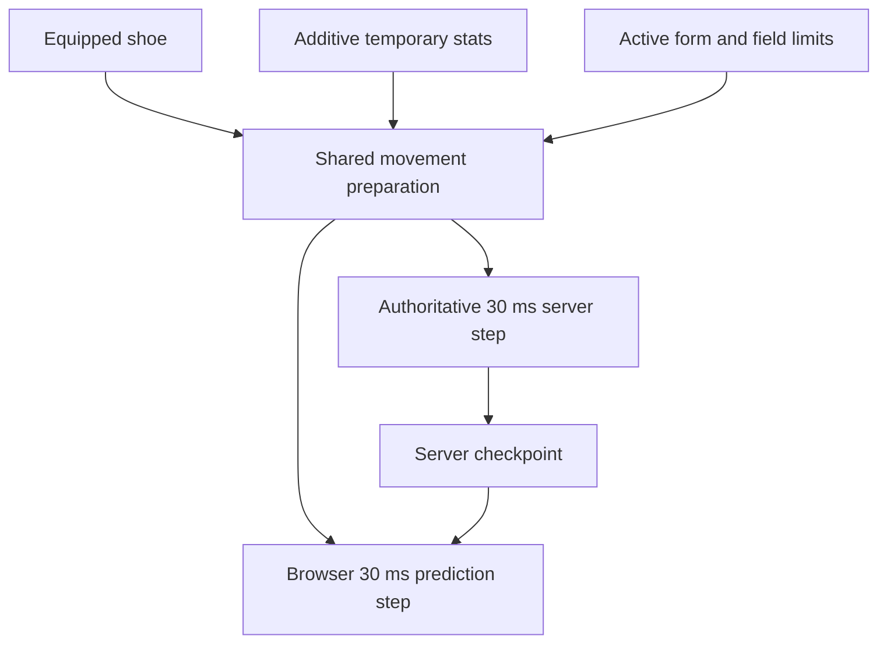

# Online movement parity

The online client and server use the same original-data movement preparation and **30 ms** simulation step. This repair changes server coefficients without changing the fixed-step clock or adding interpolation to the physics kernel.

## Cause and correction

The server previously passed `projectCharacterStats()` display totals into `updateSkillMovement()`. That function expects additive temporary bonuses. A normal displayed **100%** became **100 base + 100 bonus**, hitting the speed/jump caps of **140% / 123%**.

| Input or coefficient     | Correct meaning                                          | Owner                         |
| ------------------------ | -------------------------------------------------------- | ----------------------------- |
| Display speed/jump `100` | Total percentage shown by Stat                           | `projectCharacterStats`       |
| Derived speed/jump `0`   | No temporary bonus                                       | `SkillSystem.derived()`       |
| `walkSpeed` at 100%      | 125 world pixels/s                                       | Original Physics.img globals  |
| `jumpSpeed` at 100%      | 555 world pixels/s before gravity                        | Original Physics.img globals  |
| First grounded jump tick | `y = −16.75`, `vy = −495` on the flat regression fixture | Recovered 30 ms integration   |
| Normal upper caps        | Speed 140%, jump 123%                                    | Original normal-player branch |

`updatePlayerMovement(sim, equipment, items, derived)` is the shared movement kernel used by the authoritative server and browser prediction. It first resolves the real shoe's friction/swimming properties, then applies cached temporary skill bonuses and active form rules from original base coefficients. Recasts/cancellation cannot compound an earlier multiplier. The server keeps display/combat totals for their existing consumers.



The browser restores authoritative coefficients from motion checkpoints. Its own motion is the source of truth for its position unless the server owns the transition (see [client-owned motion](#client-owned-motion-and-diverts)) and a watchdog refutes it. The shared helper preserves equipment and buff semantics without expanding the set of supported movement controllers.

## Client-owned motion and diverts

Product priority: fluid client movement beats strict client/server agreement. Nothing that
diverts the player from the plain jump path — a movement skill, a midair mob hit, a knockback —
may produce a visible glitch, so the authority no longer publishes positional corrections for
ordinary play.

| Contract                           | Owner                                                       | Behaviour                                                                                                                                                                                                                                                                                                                                     |
| ---------------------------------- | ----------------------------------------------------------- | --------------------------------------------------------------------------------------------------------------------------------------------------------------------------------------------------------------------------------------------------------------------------------------------------------------------------------------------- |
| `input.motion` (`x`,`y`,`vx`,`vy`) | `OnlinePrediction.predict` → `OnlineWorld.input`            | Each input sample reports the state it extends (end of `targetTick - 1`), bounded to the same ±1048576 range as a checkpoint. `Transport.neutral` heartbeats omit it.                                                                                                                                                                         |
| Adoption                           | `adoptReportedMotion` in [world.js](../server/src/world.js) | The report becomes the tick's base; grounded points are re-projected with the kernel's own `009b1553` attach math. The server never glides the client onto its own trajectory.                                                                                                                                                                |
| Server-owned refusals              | `adoptionPermitted`                                         | Seat, ladder, movement lock, death, pending field transition, pending hit, blocked movement, a pending or just-published authoritative divert, and every report the client predicted before that divert (identified by input sequence) keep the server state and correct as before. No admission, portal or collision rule is weakened.       |
| Divert                             | `motion.diverts[]` in [protocol.js](../shared/protocol.js)  | A server-owned impulse (mob knockback, movement skill) is published with its exact `{vx, vy}` merge vector, its source, the tick whose kernel step first integrated it — always the step after the merge was recorded, since combat and skills run after `moveActor` — and `before`: the kernel checkpoint from immediately before the merge. |
| Divert replay                      | `OnlinePrediction.replayDiverts`                            | The client restores `before`, merges the same vector through the same `applyExternalImpulse`, retires history to `tick - 1` and re-steps the retained suffix. The replayed tick must reproduce the published checkpoint, or the divert is rejected.                                                                                           |
| Divert fallback                    | `adoptCheckpoint`                                           | A retired tick, a stale label, a missing history entry, a changed field epoch or a failed reproduction falls back to authoritative adoption plus the existing bounded glide. A replayed divert may exceed the 24 px snap bound (up to 96 px) but is removed at ≤ 0.125 px/ms (walkSpeed).                                                     |
| Watchdog                           | [watchdog.js](../server/src/watchdog.js)                    | An isolated deviation is adopted and only recorded; motion the kernel cannot explain is judged against `MOTION_PLAUSIBILITY` (900 px/s of elapsed gap, ≥32 px one-quantum floor, 700 px/s instantaneous). One impossible report, or 6 deviations in 900 ticks, closes the session.                                                            |
| Resume                             | `World.adoptResumedMotion`                                  | A resumed client offers its locally presented motion in `hello.resume.motion`; the same watchdog judges it against the disconnect gap, so a player who kept moving resumes where they are instead of snapping back.                                                                                                                           |

`before` is carried rather than derived because `mergeImpulse` is a non-invertible clamp and
the merge also detaches ground, ladder and seat: the pre-merge kernel state cannot be
reconstructed from the post-impulse checkpoint. Replaying at the published tick is what keeps
the client's own lead instead of overwriting its unacknowledged suffix.

Known limitations:

- The client still freezes prediction after `STALE_OBSERVATION_MS` (1 s) without authenticated
  timing, so "walking around while disconnected" is bounded by that window; the resume handoff
  reports wherever the client actually stopped. Continuing local prediction across a longer gap
  is a separate change.
- Presentation still samples only `presentation.x/y` in `bun tools/openms.js smoothness`, which
  holds one key. It cannot exercise a divert, so divert continuity is proven by
  `client/test/divert-alignment.test.js` (synthetic base and vector) and
  `server/test/hit-divert-replay.test.js` (a real midair mob knockback published by the
  production field and replayed by a real predictor) rather than by that tool.

```sh
bun test client/test/divert-alignment.test.js server/test/hit-divert-replay.test.js server/test/motion-adoption.test.js
```

## Source evidence

| Evidence                            | Location                                                                                              |
| ----------------------------------- | ----------------------------------------------------------------------------------------------------- |
| Original globals and motion quantum | [Decoded WZ globals](ghidra-physics-motion/wz-globals.json) · [Physics evidence](physics-evidence.md) |
| Normal movement and caps            | Native `0094d8f1..0094d9be`                                                                           |
| Form and shoe coefficients          | Native `0094d3d9`, `005cac3d`, `0094da00`                                                             |
| Field-limit override                | Native `0094d311`                                                                                     |
| Shared implementation               | [skill-movement.js](../client/src/physics/skill-movement.js)                                          |
| Client / server call sites          | [prediction.js](../client/src/online/prediction.js) · [world.js](../server/src/world.js)              |
| Wire continuation                   | [motion.js](../shared/motion.js) · [Protocol checkpoints](server/protocol.md#motion-checkpoints)      |

## Scoped verification

### Jump audio and midair attacks

| Symptom                                  | Cause                                                                                                                                                       | Current behavior                                                                                                                                                                                                                                   |
| ---------------------------------------- | ----------------------------------------------------------------------------------------------------------------------------------------------------------- | -------------------------------------------------------------------------------------------------------------------------------------------------------------------------------------------------------------------------------------------------- |
| Jump sound missing                       | The browser predictor did not consume the confirmed `groundJumpSequence`.                                                                                   | `OnlinePrediction` observes new server-confirmed jump sequence numbers and cues original `Game/Jump`. Duplicate checkpoints, replay and initial/rejoin baselines stay silent. Invalid airborne jump presses produce no sound.                      |
| Position steps when attacking midair     | An action lock switched the local avatar from prediction to older entity interpolation; the 90ms entity snapshot also overwrote the 30ms checkpoint's lock. | Local presentation continues using the predictor through an action lock. The shared motion kernel suppresses input while continuing gravity/inertia; the latest server checkpoint owns the lock. Attack pose, hits and damage remain server-owned. |
| Stationary peer climbing keeps animating | The online peer path reseeked the climb sequence without applying the original consecutive-Y hold branch.                                                   | `ladder`, `rope`, `ladder2` and `rope2` hold their current frame while consecutive authoritative Y positions match, then resume when Y changes. Other actions never inherit the hold.                                                              |

This follows the lock/integration order in `physics/simulation.js` and the retained original `00452792..004527d3` ladder/rope action and consecutive-Y comparisons. No original physics coefficients changed; the remote presentation change is limited to the recovered climb-frame hold. The online read-only snapshot includes audio state and output-capture diagnostics for reproducing sound failures.

The targeted regressions in `client/test/sync-alignment.test.js` cover accepted jumps, duplicate/rejoin suppression, uint32 sequence wrap, motion continuity through a midair action lock, and stationary-versus-moving peer climb frames. `bun server/tools/check-entry-repairs.js` additionally uses native jump/attack input and captures actual audio output with fixture music muted; it reuses assets and owns disposable accounts/database/listeners.

```sh
bun test server/test/movement-parity.test.js client/test/sync-alignment.test.js client/test/physics.test.js
```

The original coefficient repair's retained run passed **33 tests, 795 assertions**. Its regression invokes the real `OnlineWorld.moveActor` path and compares every walking/jumping tick with the shared preparation and integration fixtures. It covers 100%, buff replacement/cancellation, shoe friction/swimming coefficients, anti-slip shoes, riding forms, restricted fields and received checkpoint continuation. Current focused tests cover replay, presentation isolation and motion boundaries; jump/audio regressions extend that coverage.

Geometry and buff inputs are explicit isolating fixtures; original globals are independently decoded. This is executable kernel/server parity proof, not a new Windows capture or a network-latency benchmark. Restart both development commands after this runtime change so rules identities match.
