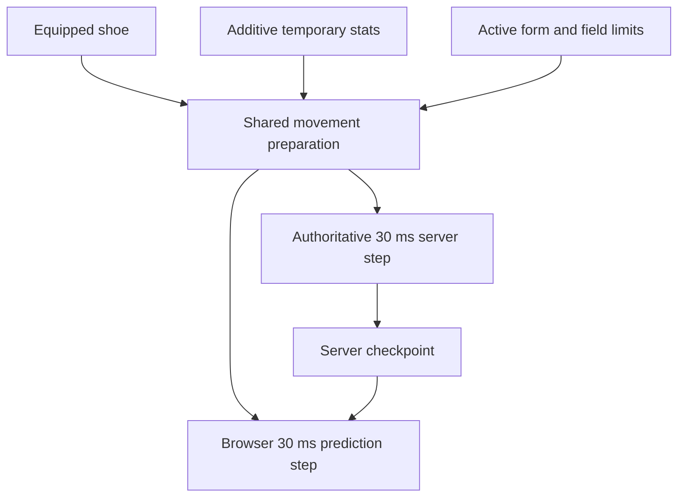

# Online movement parity

The online client and server use the same original-data movement preparation and **30 ms** simulation step. This repair changes server coefficients without changing the fixed-step clock or adding interpolation to the physics kernel.

## Cause and correction

The server previously passed `projectCharacterStats()` display totals into `updateSkillMovement()`. That function expects additive temporary bonuses. A normal displayed **100%** became **100 base + 100 bonus**, hitting the speed/jump caps of **140% / 123%**.

| Input or coefficient     | Correct meaning                                          | Owner                         |
| ------------------------ | -------------------------------------------------------- | ----------------------------- |
| Display speed/jump `100` | Total percentage shown by Stat                           | `projectCharacterStats`       |
| Derived speed/jump `0`   | No temporary bonus                                       | `SkillSystem.derived()`       |
| `walkSpeed` at 100%      | 125 world pixels/s                                       | Original Physics.img globals  |
| `jumpSpeed` at 100%      | 555 world pixels/s before gravity                        | Original Physics.img globals  |
| First grounded jump tick | `y = −16.75`, `vy = −495` on the flat regression fixture | Recovered 30 ms integration   |
| Normal upper caps        | Speed 140%, jump 123%                                    | Original normal-player branch |

`updatePlayerMovement(sim, equipment, items, derived)` is the shared movement kernel used by the authoritative server and browser prediction. It first resolves the real shoe's friction/swimming properties, then applies cached temporary skill bonuses and active form rules from original base coefficients. Recasts/cancellation cannot compound an earlier multiplier. The server keeps display/combat totals for their existing consumers.



The browser restores authoritative coefficients from motion checkpoints. It never submits its own speed, jump height or position as an authoritative result. The shared helper preserves equipment and buff semantics without expanding the set of supported movement controllers.

## Source evidence

| Evidence                            | Location                                                                                              |
| ----------------------------------- | ----------------------------------------------------------------------------------------------------- |
| Original globals and motion quantum | [Decoded WZ globals](ghidra-physics-motion/wz-globals.json) · [Physics evidence](physics-evidence.md) |
| Normal movement and caps            | Native `0094d8f1..0094d9be`                                                                           |
| Form and shoe coefficients          | Native `0094d3d9`, `005cac3d`, `0094da00`                                                             |
| Field-limit override                | Native `0094d311`                                                                                     |
| Shared implementation               | [skill-movement.js](../client/src/physics/skill-movement.js)                                          |
| Client / server call sites          | [prediction.js](../client/src/online/prediction.js) · [world.js](../server/src/world.js)              |
| Wire continuation                   | [motion.js](../shared/motion.js) · [Protocol checkpoints](server/protocol.md#motion-checkpoints)      |

## Scoped verification

### Jump audio and midair attacks

| Symptom                                  | Cause                                                                                                                                                       | Current behavior                                                                                                                                                                                                                                   |
| ---------------------------------------- | ----------------------------------------------------------------------------------------------------------------------------------------------------------- | -------------------------------------------------------------------------------------------------------------------------------------------------------------------------------------------------------------------------------------------------- |
| Jump sound missing                       | The browser predictor did not consume the confirmed `groundJumpSequence`.                                                                                   | `OnlinePrediction` observes new server-confirmed jump sequence numbers and cues original `Game/Jump`. Duplicate checkpoints, replay and initial/rejoin baselines stay silent. Invalid airborne jump presses produce no sound.                      |
| Position steps when attacking midair     | An action lock switched the local avatar from prediction to older entity interpolation; the 90ms entity snapshot also overwrote the 30ms checkpoint's lock. | Local presentation continues using the predictor through an action lock. The shared motion kernel suppresses input while continuing gravity/inertia; the latest server checkpoint owns the lock. Attack pose, hits and damage remain server-owned. |
| Stationary peer climbing keeps animating | The online peer path reseeked the climb sequence without applying the original consecutive-Y hold branch.                                                   | `ladder`, `rope`, `ladder2` and `rope2` hold their current frame while consecutive authoritative Y positions match, then resume when Y changes. Other actions never inherit the hold.                                                              |

This follows the lock/integration order in `physics/simulation.js` and the retained original `00452792..004527d3` ladder/rope action and consecutive-Y comparisons. No original physics coefficients changed; the remote presentation change is limited to the recovered climb-frame hold. The online read-only snapshot includes audio state and output-capture diagnostics for reproducing sound failures.

The targeted regressions in `client/test/sync-alignment.test.js` cover accepted jumps, duplicate/rejoin suppression, uint32 sequence wrap, motion continuity through a midair action lock, and stationary-versus-moving peer climb frames. `bun server/tools/check-entry-repairs.js` additionally uses native jump/attack input and captures actual audio output with fixture music muted; it reuses assets and owns disposable accounts/database/listeners.

```sh
bun test server/test/movement-parity.test.js client/test/sync-alignment.test.js client/test/physics.test.js
```

The original coefficient repair's retained run passed **33 tests, 795 assertions**. Its regression invokes the real `OnlineWorld.moveActor` path and compares every walking/jumping tick with the shared preparation and integration fixtures. It covers 100%, buff replacement/cancellation, shoe friction/swimming coefficients, anti-slip shoes, riding forms, restricted fields and received checkpoint continuation. Current focused tests cover replay, presentation isolation and motion boundaries; jump/audio regressions extend that coverage.

Geometry and buff inputs are explicit isolating fixtures; original globals are independently decoded. This is executable kernel/server parity proof, not a new Windows capture or a network-latency benchmark. Restart both development commands after this runtime change so rules identities match.
