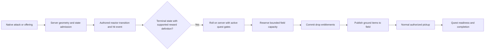

# Reactor loot, Pio and scroll feedback

This repair connects original assets to the existing offline owners and online transactions. Reference scripts and SQL describe content/interfaces; they are parsed as data, never executed or copied into a server implementation.

## Evidence and ownership

| Feature | Original/reference input | Runtime contract |
| --- | --- | --- |
| Pio, quest 1008 | `Quest.wz:Check.img/1008`, `Act.img/1008`, `Say.img/1008`; `Npc.wz:0010000.img` | The completion stage omits `npc`. Resolve its endpoint to the starting NPC 10000 when neither completion check supplies one. Explicit completion NPCs take precedence. Use that same resolution for menu membership, server admission, marker and journal portrait. |
| Scrap boxes | `Map/Map0/001000000.img/reactor`; `Reactor/0002001.img` | Four admitted hits advance the authored states. Use original placement/template identity for rewards; following an artwork link must not change the drop-table key. |
| Reactor sounds | `Sound.wz:Reactor.img/1012000/{0,1,2,3}/Hit` | Resolve the authored state first, then its linked artwork state. The requested audible-hit policy fills missing families/states with `Sound.wz:Reactor.img/2000/{state}/Hit`, or state 0 when that state is absent. Descriptors identify `authored`, `linked-artwork` or `fallback-box`; preserve exact source paths and MP3 bytes. Each accepted server event carries the previous state; recipients play that state with the original distance-volume curve. |
| Reactor rewards | `infra/gameplay-definitions/reactor/2001.js`, `1012000.js`; `infra/sql/data/131-reactordrops-data.sql` | A closed parser admits a single literal `rm.dropItems(...)` action. SQL chances are denominators, separate from mob millionths. Quest rows require an active quest, and ordinary pickup rechecks eligibility. |
| Pio items/reward | Items 4031161 and 4031162; quest 1008 completion Act | Each collected item is required once. Native quest completion consumes them and grants 100 EXP/200 mesos through the existing quest transaction. Merely opening a menu grants nothing. |
| Scroll result | `Effect/BasicEff.img/Enchant/Success`, `Enchant/Failure`; `Sound/Game.img/EnchantSuccess`, `EnchantFailure` | Only a newly applied server inventory transaction broadcasts `equipment.enhancement`. Every recipient plays the original animation at the scrolling character and the corresponding sound. Curse uses failure presentation. |
| Equipment tooltip | Original String IDs `0x291..0x298`, `0x7f8`, `0x7fa..0x801`; [font palette](ghidra-client/item-tooltip/fonts.txt), [stat row/width consumers](ghidra-client/item-tooltip/stat-rows.txt) | Show instance total, WZ base and signed difference, plus upgrade count/remaining slots. Unowned previews cannot inherit an owned item's modifiers. Retain original uppercase stat labels and explicit Arial 12 typography. Native `008f39e1` measures label/value width and adds 20px; allow the browser equipment frame to grow from 236px up to its 290px item bound so the slot count stays with its label. |
| Status notices | Original `0089b60f`, `0089b76f`; [earlier notice evidence](ingame-audiovisual.md) | Requested browser policy keeps the collapsed native anchor `(504,443)` at 800×600 even while quickslots are open. Preserve six 14px rows, right alignment and six-second fade. |
| Game Logs | `UI/Basic.img/Notice4/t,c,s` | Browser diagnostics use a continuous 266px frame: 21px top, eighteen 20px centers, and the final 18px of the 78px bottom. Center tiles cover the original prompt-only input well. Editor and footer share 12px side insets; every action is 22px high and remains within the frame. |

The supplied scrap-box template `0002001` has neither `info/link` nor a `Sound/Reactor.img/2001` family. It must not be described as linked to `0002000`; that separate template owns its own sound family. The user's follow-up explicitly requests sound for every reactor hit, including these boxes. The browser therefore assigns the existing original `2000` box hit to `2001` and other missing hit assignments. This fallback is a requested application policy, not a recovered original link. Timed-only/terminal states receive no invented hit sound. Authored assignments retain their original resources.

The retained [reactor event consumer](ghidra-ingame-portals/reactor-events.txt) calls `009894f3` for distance volume before `00989add`; [sound lookup](ghidra-ingame-portals/entities-motion.txt) formats `Sound/Reactor.img/%s/%s` with `Hit`. Browser playback now supplies that same distance percentage. The audio inspection snapshot retains the last started SE source/hash separately from actual post-mix PCM capture.

The tooltip's base is the original WZ value. The saved instance contains totals, not a historical ledger of every scroll; a legacy randomized item's difference can therefore also include its initial variation. Exact Windows glyph rasterization is not claimed.

## Reward path

`reactor-reward-compiler.js` records source hashes and rejects extra statements, dynamic arguments and unsupported scripts. `catalog.drops.reactors` packages programs/rows; extraction includes their item dependencies. The shared roll kernel grants nothing by itself. Online `reactor-rewards.js` captures the hitter, fences each terminal generation, commits durable drop entitlements and reuses the existing field-drop/pickup owners. Failed transactions release reservations and publish no collectible items. Pending rewards prevent field retirement; shutdown waits for them. Offline `DropSystem.spawnReactor` uses the same content and ordinary local pickup.

Complex event scripts with extra commands or conditionals remain explicitly unsupported. This is ordinary reactor loot support, not arbitrary script execution or complete party-quest/event emulation. Ground-item fanout/lifetime currently use the shared field-drop policy rather than the reference server's separate reactor-specific 200ms stagger.

## Reproduction and maintenance

1. Read the raw WZ stage/template first. Preserve original IDs separately from resolved artwork IDs. Inspect missing fields rather than inventing new art or empty quest offers.
2. Inspect original consumers using retained Ghidra output; `docs/tools/clientLoginLayout.java` can recover bounded known function entries. The tooltip font constructor is `008e49b5`; the original scroll effect path strings are `0xd6f/0xd70`.
3. Finish extraction recipe edits, then run scoped formatting/lint and reactor tests before one incremental `bun run extract`. Do not hand-edit catalog hashes or generated map files. Browser-only edits reuse that extraction.
4. Run `bun server/tools/check-recycling-scrolls.js --output /tmp/openms-recycling-scrolls` for the affected native path. It creates a disposable database and two isolated clients on Pio's map, plus a separate plant-reactor client; the active quest and one real 100% scroll are declared fixture setup. The clients perform hits, pickups, quest dialogue, scrolling, HUD controls and reconnect through real input. The plant check uses map `101010100`, reactor `2` (template `1012000`) and its original MP3.

The keybinding regression is independent of quest rules: online inspection can outlive the currently attached profile during login/logout. `KeyBindings.snapshot()` retains the last committed binding reference during this gap, while editing requires an attached profile.

## Loading and reactor audio follow-up

Run `bun server/tools/check-loading-reactor-audio.js --output /tmp/openms-loading-reactor-audio` for the scoped follow-up. It uses disposable box/plant accounts and native input. It holds a genuine cold map download, then a genuine reactor MP3 download, verifies fullscreen versus corner loading at 800×600 and 1280×800, and checks movement remains available during the audio fetch. It waits for weapon/UI sounds to finish before releasing the reactor MP3 into a BGM-muted mixer and capturing nonzero output. Cached equipment changes and cached map re-entry must produce no fullscreen-loading transitions. Source and catalog identities are checked against the served browser.
