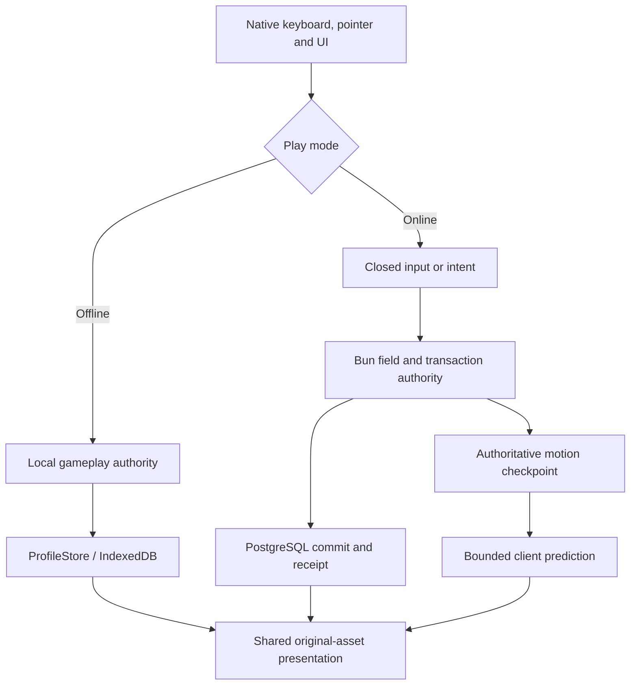

# Shared integration contract

Offline and online reuse original-data consumers and presentation. **The mode chooses the state owner.** The browser interchange formats below are project contracts, not original WZ or Nexon network APIs. Follow [coding style](coding-style.md) and [input provenance](inputs.md).

## Subsystem boundaries

| Domain                           | Offline owner                                  | Online owner                                                  | Detailed contract                                          |
| -------------------------------- | ---------------------------------------------- | ------------------------------------------------------------- | ---------------------------------------------------------- |
| Input and movement               | `InGameSystems`, shared simulation             | `OnlineWorld`, shared simulation; browser predicts            | [Movement](movement-parity.md)                             |
| Profile and inventory            | `ProfileStore`, atomic IndexedDB commits       | PostgreSQL transactions and participant publication           | [Saves](offline-saves.md) · [Protocol](server/protocol.md) |
| Combat and skills                | `OfflineField`, `SkillSystem`                  | Server combat/skill phases using shared rules                 | [Combat](offline-combat.md) · [Skills](skills.md)          |
| NPC and quest turns              | Local script/quest authority                   | Conversation leases and transactional rewards                 | [NPCs](ingame-life.md) · [Quests](ingame-quests.md)        |
| Social and commerce              | Explicit local peers and atomic exchanges      | Authenticated participants, membership and receipts           | [Feature map](server/offline-parity.md)                    |
| Rendering, UI and audio          | Persistent presentation owners                 | Same original-resource consumers with read-only online models | [UI](ingame-ui.md) · [Audio](ingame-audiovisual.md)        |
| Artwork and offline installation | Shared asset caches; optional verified release | Immutable assets; no offline gameplay continuation            | [Delivery](asset-delivery.md) · [Streaming](streaming.md)  |

The online build rejects imports of offline persistence and gameplay authority. `NativeProfileSource` publishes server snapshots and has no local save/commit API. Camera, menus, audio and UI drafts are local; economic or character outcomes require server authorization.

## Character state

The current profile is **schema 8**. It contains character stats, appearance, UID-bearing items/equipment, AP, ten SP pools, learned skills, quests, typed saved locations, settings/bindings, cash, pets/mount, Monster Book, macros and social domains. Valid v1–v7 saves migrate without granting progress. [Profile schemas](offline-profile.md#schema-8) and [save semantics](offline-saves.md) own the exact fields.

Offline transactions validate an isolated draft, compare durable revision/generation and publish only after commit. Consumers reacquire the profile root after replacement. Pending transactions exclude competing gameplay mutations while rendering remains live. Online transactions use participant/account ownership, revision checks and idempotent receipts; reconnect obtains server state rather than merging browser progress.

## Motion and bounds

| Entry point                                            | Contract                                                                                          |
| ------------------------------------------------------ | ------------------------------------------------------------------------------------------------- |
| `createSimulation(world, {x,y})`                       | Validate immutable physics metadata; allocate reusable state.                                     |
| `updatePlayerMovement(sim, equipment, items, derived)` | Rebuild from original coefficients, shoe metadata, active forms and **additive** temporary stats. |
| `advanceSimulation(sim, input, elapsedMs, onStep?)`    | Offline bounded accumulation; execute fixed 30 ms steps and the per-step callback.                |
| `stepMotion(sim, input)`                               | Server/prediction boundary: exactly one 30 ms step, no second accumulator.                        |
| `captureMotion` / `restoreMotion`                      | Complete server-authored continuation state, including coefficients, contacts and held edges.     |
| `snapshotSimulation`                                   | Allocate an observation outside the hot loop.                                                     |

Held movement/attack/jump inputs are separate from edges. No renderer or socket callback advances a second physics clock. Ambient presentation may use frame elapsed time; gameplay and player action clocks follow simulation ticks. Action overrides do not rewrite base locomotion state. [Avatar actions](avatar-actions.md) defines one-shot completion and frame ownership.

The server retains projected display/combat statistics separately. **100% is a total, not a +100 bonus.** [Movement parity](movement-parity.md) records the repaired call boundary and regression proof.

Body, attack and damage bounds come from recovered geometry consumers, not sprite extents. `createHitboxState` allocates reusable shapes; `updateHitboxes` mutates them. Shape validity and known activation timing are distinct. See [hitboxes](hitboxes.md).

## Physics data

`readPhysicsData(map, physics)` in `client/tools/physics-data.js` consumes parsed original WZ nodes and publishes schema 1 metadata:

| Field                         | Contents                                                     |
| ----------------------------- | ------------------------------------------------------------ |
| `globals`, `map`              | Original global and map-property names/scalars               |
| `footholds`                   | IDs, layers/groups, endpoints, links and original properties |
| `ladders`, `portals`, `areas` | Authored geometry and destination/area metadata              |
| `unsupported`                 | Exact property paths and unresolved reasons                  |

Preserve unknown properties and report unsupported active behavior. Footholds may load together as bounded collision metadata; artwork streams independently by region.

## Versioned asset streaming

[Scene format](scene-contract.md) is the canonical schema reference; [streaming](streaming.md) owns residency, cancellation and replacement. This contract does not duplicate their JSON layouts.

| Resource      | Version and responsibility                                                                   |
| ------------- | -------------------------------------------------------------------------------------------- |
| Catalog       | Schema 2; build identity, verified map descriptors and shared UI/audio/gameplay metadata     |
| Map / region  | Schema 2; bounds, physics, entities, textures, atlas descriptors and region membership       |
| Visual bundle | Schema 1; shared original textures, entities and metadata with an explicit `destroy()` owner |

Descriptors retain SHA-256 and byte length. Atlas/region/map publication is deterministic and content-addressed. Transparent RGBA must round-trip exactly. `Entity.order` retains global extraction order across region arrivals; tiled canvases retain logical `sourceSize`, `sourceCanvas` and `sourceRect`. Animation delays, origins, alpha and layers keep their recovered meaning.

Only the visible/always regions and initial actor resources gate readiness. Publish regions atomically after required atlases are ready. Cancel obsolete demand, retain the last complete scene during replacement, and release shared resources by ownership. Do not create a second network or atlas cache.

## In-game ownership and input

| Owner                      | Lifetime and obligation                                                                    |
| -------------------------- | ------------------------------------------------------------------------------------------ |
| `InGameSystems`            | Persistent UI/audio and the offline travel gate                                            |
| `StreamScene.fieldSystems` | Field-local gameplay, portals, life and overlays                                           |
| `loadVisualBundle` result  | Caller owns lifetime after load; destroy consumers before the shared resource owner        |
| Input/editor/modal owner   | Consume applicable keys before field actions; release held input on loss of ownership      |
| Transition owner           | Validate destination, retain the old complete scene on failure, invalidate stale callbacks |

Ordinary named portal arrival is `(x, y−10)`; authored return-map revival uses the same transition pipeline. Same-map travel preserves the recovered camera history. See [portal contracts](ingame-portals.md) for supported types and timing.

Original NPC `dc` rectangles drive pointer selection. Quest state is absent/not-started, active or completed; reward eligibility is rechecked at commit. Unsupported script calls/controllers stay unavailable. Development inspection never grants a normal player additional authority.

## UI and viewport

The original UI uses a logical **800 × 600** plane, bottom-centered where appropriate. Larger desktop viewports use documented browser adaptation. Original origins and frame placement remain part of the resource contract; browser fonts are not proven Windows raster parity. [UI](ingame-ui.md) and [login recovery](login-creation-recovery.md) own placement details.

## Offline delivery

Asset installation and saves are separate. The service worker stages and verifies a complete immutable release before activating readiness; active pinned assets are not ordinary evictable cache entries. Missing, corrupt, quota or network outcomes stay visible. Online `/api/` stays network-only, and online startup does not install this offline release service worker.

## Change and verification

Use the [smallest relevant check](validation-method.md#validation-scope). For online behavior, name the intent, authoritative result, recipient update and reconnect state. For diagrams and documentation, follow the [documentation guide](documentation-guide.md). Historical captures are indexed separately in [validation](validation.md).
