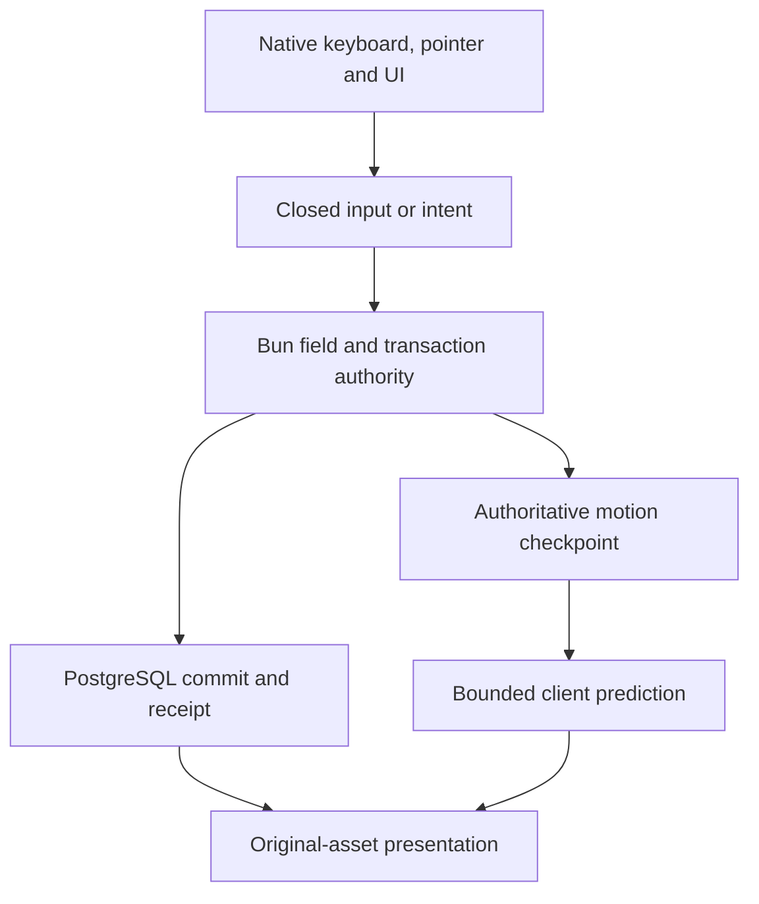

# Online integration contract

The browser client consumes original-data presentation resources and submits bounded input or UI intents. The Bun server owns gameplay state, durable changes and recipient publication. These interchange formats are project contracts, not original WZ or Nexon network APIs. Follow [coding style](coding-style.md) and [input provenance](inputs.md).

## Subsystem boundaries

| Domain                  | Authority and presentation boundary                                  | Detailed contract                                           |
| ----------------------- | -------------------------------------------------------------------- | ----------------------------------------------------------- |
| Input and movement      | Server steps shared motion; the browser predicts received input      | [Movement](movement-parity.md)                              |
| Profile and inventory   | PostgreSQL transactions publish read-only character snapshots        | [Protocol](server/protocol.md)                              |
| Combat and skills       | Server combat/skill phases use shared deterministic rule modules     | [Coverage](server/offline-parity.md) · [Skills](skills.md)  |
| NPC and quest turns     | Server conversation leases and transactions; browser renders results | [NPCs](ingame-life.md) · [Quests](ingame-quests.md)         |
| Social and commerce     | Authenticated participants, membership and receipts                  | [Coverage](server/offline-parity.md)                        |
| Rendering, UI and audio | Browser-owned original-resource consumers with read-only models      | [UI](ingame-ui.md) · [Audio](ingame-audiovisual.md)         |
| Assets                  | Content-addressed generated catalog and demand-loaded resources      | [Extraction](asset-delivery.md) · [Streaming](streaming.md) |

The browser build guard rejects imports of server-side gameplay authority and persistence modules. `NativeProfileSource` publishes received server snapshots and has no local save or commit API. Camera, menus, audio and UI drafts are local; economic or character outcomes require a server receipt.

## Character state

The server validates the schema-8 character record: statistics, appearance, UID-bearing inventory/equipment, AP, SP pools, learned skills, quests, saved locations, settings/bindings, cash, pets/mount, Monster Book, macros and social domains. Database transactions use participant/account ownership, revision checks and idempotent receipts. Reconnect restores the server record; the browser never merges local progression.

## Motion and bounds

| Entry point                                            | Contract                                                                            |
| ------------------------------------------------------ | ----------------------------------------------------------------------------------- |
| `createSimulation(world, {x,y})`                       | Validate immutable physics metadata and allocate reusable state                     |
| `updatePlayerMovement(sim, equipment, items, derived)` | Rebuild original coefficients, shoe metadata, forms and additive temporary stats    |
| `stepMotion(sim, input)`                               | Server/prediction boundary: exactly one 30 ms step                                  |
| `captureMotion` / `restoreMotion`                      | Server-authored continuation state, including coefficients, contacts and held edges |
| `snapshotSimulation`                                   | Allocate an observation outside the hot loop                                        |

Held movement, attack and jump inputs are distinct from one-shot edges. No renderer or socket callback advances a second physics clock. Ambient presentation may use frame elapsed time; gameplay and player action clocks follow authoritative ticks. [Avatar actions](avatar-actions.md) defines one-shot completion and frame ownership.

The server retains projected display/combat statistics separately. **100% is a total, not a +100 bonus.** [Movement parity](movement-parity.md) records the repaired call boundary and regression proof.

Body, attack and damage bounds come from recovered geometry consumers, not sprite extents. `createHitboxState` allocates reusable shapes; `updateHitboxes` mutates them. Shape validity and known activation timing are distinct. See [hitboxes](hitboxes.md).

## Physics data

`readPhysicsData(map, physics)` in `client/tools/physics-data.js` consumes parsed original WZ nodes and publishes schema-1 metadata:

| Field                         | Contents                                                     |
| ----------------------------- | ------------------------------------------------------------ |
| `globals`, `map`              | Original global and map-property names/scalars               |
| `footholds`                   | IDs, layers/groups, endpoints, links and original properties |
| `ladders`, `portals`, `areas` | Authored geometry and destination/area metadata              |
| `unsupported`                 | Exact property paths and unresolved reasons                  |

Preserve unknown properties and report unsupported active behavior. Footholds may load together as bounded collision metadata; artwork streams independently by region.

## Versioned asset streaming

[Scene format](scene-contract.md) is the canonical schema reference; [streaming](streaming.md) owns residency, cancellation and replacement.

| Resource      | Version and responsibility                                                            |
| ------------- | ------------------------------------------------------------------------------------- |
| Catalog       | Schema 2; build identity, map descriptors and shared UI/audio/gameplay metadata       |
| Map / region  | Schema 2; bounds, physics, entities, textures, atlases and region membership          |
| Visual bundle | Schema 1; original textures, entities and metadata with an explicit `destroy()` owner |

Descriptors retain SHA-256 and byte length. Publication is deterministic and content-addressed. Only visible/always regions and initial actor resources gate readiness. Publish regions atomically after required atlases are ready, cancel obsolete demand and retain the last complete scene during replacement.

## In-game ownership and input

| Owner                     | Lifetime and obligation                                                             |
| ------------------------- | ----------------------------------------------------------------------------------- |
| `OnlineUI`                | Persistent native windows, audio and read-only character projections                |
| `OnlineScene`             | Field-local presentation, prediction targets, portals, life and received events     |
| `loadVisualBundle` result | Caller owns lifetime after load; destroy consumers before the shared resource owner |
| Input/editor/modal owner  | Consume applicable keys before field actions; release held input on ownership loss  |
| Transition owner          | Validate the received destination and retain the last complete scene on failure     |

Ordinary named portal arrival is `(x, y−10)` after server admission. Same-map travel preserves recovered camera history. Original NPC `dc` rectangles drive pointer selection; unsupported script calls/controllers remain unavailable. Development inspection never grants a normal player additional authority.

## UI and viewport

The original UI uses a logical **800 × 600** plane, bottom-centered where appropriate. Larger desktop viewports use documented browser adaptation. Original origins and frame placement remain part of the resource contract; browser fonts are not proven Windows raster parity. [UI](ingame-ui.md) and [login recovery](login-creation-recovery.md) own placement details.

## Change and verification

Use the [smallest relevant check](validation-method.md#validation-scope). For online behavior, name the intent, authoritative result, recipient update and reconnect state. Historical offline captures remain in the archive as evidence for earlier builds; they are not current runtime support.
