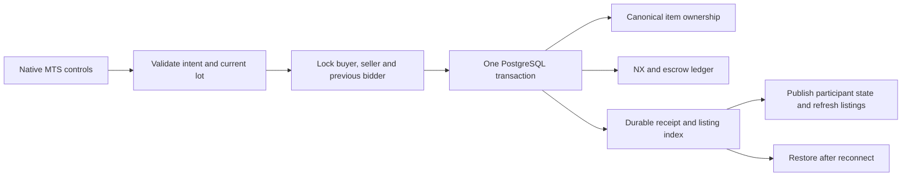

# Maple Trading System

MTS is an OpenMS service built around existing character transactions. It does not copy Cosmic code or scripts. Open the **Trade** button on the HUD to browse listings; select an inventory item to register a lot. Payment providers remain outside scope.

## 🛒 Player operations

| Operation           | Behavior                                                                                                                                                                |
| ------------------- | ----------------------------------------------------------------------------------------------------------------------------------------------------------------------- |
| Browse              | Search by item name or ID; filter Equip, Use, Setup and Etc; paginate listings and transfer inventory.                                                                  |
| Fixed-price listing | Move a whole or partial stack into escrow. The price covers the entire lot.                                                                                             |
| Item details        | Inspect the server-published instance’s actual upgrades, inscription, expiry and one-trade restriction before purchase.                                                 |
| Purchase            | Debit the buyer's prepaid NX, credit the seller after fees, and deliver the exact item instance to transfer inventory.                                                  |
| Cart                | Save listing identities or clear the cart, including expired entries. Buying still checks the current price, deadline and owner.                                        |
| Wanted order        | Reserve payment and a delivery slot for seven days. Another character supplies the entire requested quantity.                                                           |
| Auction             | Reserve the leading bid, refund the previous bidder, and reserve delivery space. The current leader cannot bid consecutively. A listing with a bid cannot be cancelled. |
| Expiry              | Return unsold goods or wanted-order funds; settle a winning auction. Deadlines persist through restart.                                                                 |
| Claim               | Move a delivered or returned item from transfer inventory to an available inventory slot. A repeated claim cannot duplicate it.                                         |

## 🔒 Authority and persistence



| Concern             | Contract                                                                                                                                                                                                                            |
| ------------------- | ----------------------------------------------------------------------------------------------------------------------------------------------------------------------------------------------------------------------------------- |
| Item custody        | `item_instance` owns items in inventory, market escrow and transfer inventory. Cached profile envelopes contain metadata, never a duplicate item payload.                                                                           |
| Discovery           | `market_listing` is a transactionally maintained search index. The locked owner profile determines whether a lot still exists and who holds its bid.                                                                                |
| Purchase race       | Recheck owner, price, bid identity, realm and deadline inside the participant transaction. Only one transaction can remove a lot.                                                                                                   |
| Replay              | Existing operation receipts, digest checks, lease fences and revision checks apply to market writes.                                                                                                                                |
| Currency            | Use the existing **prepaid** character balance. Pending wanted payments and leading bids have separate escrow ledger entries. A leading bidder can apply reserved NX to buy-now. No new payment or NX grant endpoint is introduced. |
| Capacity            | 25 listings, 25 cart entries, 48 transfer slots, 16 results per page. Listed returns, wanted deliveries and active bids reserve transfer capacity.                                                                                  |
| Item restrictions   | Reject equipped, locked, untradeable, quest, account-only, cash and rechargeable items, unavailable templates, expired instances and lots that would outlive their item.                                                            |
| Transfer attributes | Keep upgrades, inscription and expiry. Consume a one-trade flag only when ownership changes; cancellation returns retain it. Each lot must fit the recipient’s permitted stack size.                                                |
| Account isolation   | Other characters on the same account cannot buy, bid on or fulfill their own account's lots. Listings are separated by realm.                                                                                                       |
| Character deletion  | Refuse deletion while escrow, incoming reservations, transfer items or active bids remain.                                                                                                                                          |
| Expiry work         | Process at most eight due lots per five-second batch. When no actor is online, durable deadlines wait for the next active world session. Inventory and payment ownership remain durable.                                            |
| Failure             | Insufficient NX, changed lots, invalid items and full inventory reject without partial transfer. If a recipient cannot hold more NX, settlement remains pending until capacity is available.                                        |

## 🔍 Original evidence and OpenMS choices

| Evidence                                                                                             | What it establishes                                                                                                                                                                                              |
| ---------------------------------------------------------------------------------------------------- | ---------------------------------------------------------------------------------------------------------------------------------------------------------------------------------------------------------------- |
| `UI.wz:ITC.img/Base/backgrnd`                                                                        | Original 800 × 600 stage, preview, unsold, transfer and inventory regions.                                                                                                                                       |
| `ITC.img/Tab/1..5`, `Sell/Tab`, `Sell/backgrnd`                                                      | Main tabs, column artwork and 20-pixel listing rows. Every ITC canvas/state is packaged by the existing UI extraction pipeline.                                                                                  |
| [Decoded client strings](../ghidra-client/decoded-strings.txt), IDs 4748, 4768–4769, 4800, 4814–4816 | Seller fee of 5%; cancellation restriction after a bid; auction duration of 24–168 hours; seven-day wording; transfer inventory and rechargeable restrictions.                                                   |
| OpenMS policy                                                                                        | Round seller fees up; require bid increments of at least 5%; fixed-price durations also use 24–168 hours; use prepaid NX and the explicit capacity limits above. These choices are not recovered Nexon formulas. |
| Browser placement                                                                                    | Original chrome, dimensions and item slots are retained. Registration forms, search, paging and row interaction are OpenMS adaptations. Exact Windows font, placement and interaction parity remain unverified.  |

To extend placement recovery: read the WZ branch with `WzArchive.imageReader` and `parseImage`; inspect canvas dimensions, origins and state paths; use `decodeCanvas` plus `encodePNG` for local evidence; correlate retained string addresses with Ghidra exports. Add assets through `client/tools/ui-data.js`, never by manually changing the generated catalog. Runtime composition uses `UISurface` and `replaceIcons`, preserving resource ownership and cancellation.

## 🧪 Focused checks and implementation

```sh
bun test server/test/market.test.js client/test/native-market.test.js
# Optional real PostgreSQL checks; each case creates and drops its own database.
OPENMS_TEST_DATABASE_URL=postgresql://... bun test server/test/database.test.js
bun server/tools/check-market.js /tmp/openms-market
```

The native check uses disposable accounts, an isolated PostgreSQL database, temporary listeners and independent browser contexts. Its fixture grants test NX explicitly, then normal mouse/keyboard inputs filter, cart, list, buy and claim across a server restart, then fulfill a wanted order and bid/buy an auction. Reports include source/catalog identities and transaction receipts. It also checks the recovery dialog; no recovery email is sent.

| Implementation            | Files                                                                                                                                                             |
| ------------------------- | ----------------------------------------------------------------------------------------------------------------------------------------------------------------- |
| Intents and replies       | [Market protocol](../../shared/market-protocol.js)                                                                                                                |
| Rules                     | [Orders](../../server/src/market-orders.js), [inventory](../../server/src/market-inventory.js), [state](../../server/src/market-state.js)                         |
| Admission and publication | [Market interactions](../../server/src/interaction-market.js), [expiry](../../server/src/market-schedule.js)                                                      |
| Persistence               | [Market index and escrow ledger](../../server/src/database-market.js), [migration](../../infra/sql/003-market.sql)                                                |
| Browser                   | [Read-only service](../../client/src/online/native-market.js), [original stage](../../client/src/ui/ui-market.js), [forms](../../client/src/ui/ui-market-form.js) |

Validation on **14 September 2026** passed the MTS rules, PostgreSQL custody/replay checks and native two-client scenario. The [batch evidence](implementation-validation.json) records each domain’s source identity and checks. Expiry rules are tested at the transaction level; the browser scenario does not wait seven real days.

## 🧭 Integration findings

- Bind bounded search lists as text containing JSON, then cast inside PostgreSQL. Bun SQL infers PostgreSQL parameter types; passing a plain array or a JSON string directly to a `jsonb` parameter produced invalid array/scalar values. The database regression covers empty and populated filters against real escrow rows.
- Preserve market and quest lifecycle metadata from the locked durable profile when merging continuous simulation state. A stale live snapshot or checkpoint must never resurrect a sold listing or an earlier quest cycle.
- Browser scenarios bring the acting participant tab forward before native input and use exact accessible selectors. Generic text matching did not reliably target the intended form button.
- Read-only market contention retries at most three times, preserving the last complete page and the latest queued filter. Writes are never automatically replayed. Controls show the pending state.
- Compare character revision, market page identity and local selection before rebuilding the pane. Ordinary field publications must not replace buttons under the pointer or repeatedly reload icon layers.
- Development action diagnostics record action/operation identity and internal error codes on stdout. Clients continue to receive closed protocol codes; request bodies and credentials are not logged.

## ✉️ Account recovery

The login screen uses the original extracted **Find login ID** and **Find P/W** buttons. Both open a Windows 95 style dialog that validates an email address, traps focus, supports Escape, clears the address on close and restores focus to the initiating button. It clearly states that email recovery is not available and that no email was sent. Account lookup, reset tokens and email delivery are intentionally deferred. See [dialog implementation](../../client/src/online/account-recovery.js) and [recovered button coordinates](../login-creation-recovery.md#recovery-buttons).

Expiry scheduling checks at most eight eligible lots every five seconds while an active actor is available. Each failed lot receives a durable retry deadline: 10 seconds initially, doubling to a five-minute maximum. Eligibility is ordered by `max(expires_at, retry_at)`, so blocked lots cannot monopolize later batches. The loop skips already-removed listings and continues after individual rejections. Updating another listing preserves retry metadata; successful settlement removes the index row and its retry state. Failures emit `market.expiry.deferred` with the listing ID and stable error code. No settlement rules, item reservations or currency limits are bypassed to make expiry succeed.
