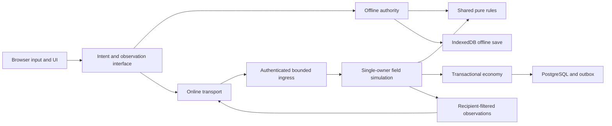

# Authoritative browser-game protocol proposal

**Status: design proposal, not an implemented backend.** The current game remains fully offline. This document defines a new web-native trust boundary; it does not expose the offline inspector, copy Cosmic packets, or claim that a schema alone prevents cheating. Implementation and adversarial server validation are separate future work.

## Decisions and research

Use **HTTPS for authentication/content and one same-origin WSS connection for gameplay**, implemented with Bun and plain JavaScript/JSDoc. Start with a modular monolith and PostgreSQL, one authoritative owner per field instance and one writer lease per character. Do not begin with microservices, distributed simulation, peer authority, or a bespoke UDP stack.

| Evidence | Design consequence |
| --- | --- |
| [Fiedler: networking and client prediction](https://gafferongames.com/post/what_every_programmer_needs_to_know_about_game_networking/) explains why reporting client position permits teleporting and why replay follows authoritative correction. [Nakama authoritative multiplayer](https://heroiclabs.com/docs/nakama/concepts/multiplayer/authoritative/) independently describes fixed-tick validation and single-node match ownership. | Send input/intent, not claimed results. Server simulates movement, mobs, hits, rewards and transitions. Prediction is disposable presentation. |
| [Fixed timestep](https://gafferongames.com/post/fix_your_timestep/) explains variable-step instability and overload. The current [integration contract](../offline-integration-contract.md) uses a 30 ms simulation quantum. | Initially share the existing 30 ms quantum, not an invented 60 Hz rewrite. Network publishing cadence is separate. Profile before changing either. |
| [MDN WebSocket](https://developer.mozilla.org/en-US/docs/Web/API/WebSocket) documents the absence of receive backpressure; [Bun WebSockets](https://bun.sh/docs/runtime/http/websockets) documents send outcomes and drain handling. | Bound ingress, queues, snapshots, and buffered bytes explicitly. A successful send is not an application commit acknowledgement. |
| [MDN WebTransport](https://developer.mozilla.org/en-US/docs/Web/API/WebTransport) offers HTTP/3 reliable streams and datagrams. | Consider it only after measuring WSS head-of-line delay under realistic loss and checking target browsers/proxies. It does not improve authority. Avoid WebRTC peer negotiation/ICE/TURN for a server-owned game. |
| [OWASP WebSocket security](https://cheatsheetseries.owasp.org/cheatsheets/WebSocket_Security_Cheat_Sheet.html) covers origin checks, CSWSH, per-message authorization, limits, session revocation and safe logging. | Authenticate upgrades, validate every command, revoke live sessions, disable message compression initially, and never treat origin or content hashes as anti-cheat. |
| [PostgreSQL transaction isolation](https://www.postgresql.org/docs/current/transaction-iso.html) distinguishes Read Committed from Serializable, including serialization retries. | Economy writes use short transactions, explicit invariants, durable operation receipts and bounded whole-transaction retries. Never announce an economic success before commit. |

The Valve developer networking page was blocked by its bot challenge during research; it is not cited as inspected evidence. No third-party-client implementation was used.

### What Cosmic contributes—and does not

The authorized reference tree was used as an **inventory of validation questions**, not a secure protocol, authoritative rulebook or original Nexon source. Concrete examples under `src/main/java/net/server/channel/handlers/`:

- `MovePlayerHandler.java:31–44` reads movement, updates position and broadcasts it. This design does **not** accept a client movement result as authority.
- `ChangeMapHandler.java:48–168` combines trade cancellation, death/revival, client target-map IDs, exceptional tutorial/GM branches, portal status and proximity. Here those become distinct server state-machine transitions; there is no general client target-map field.
- Handler families for attacks, pickup, scrolling, NPC conversations, quests, cash and trading identify domains requiring checks. Their presence is not a security audit or proof that their existing checks are sufficient.

Map topology, footholds, artwork and recoverable client mechanics come from original WZ/Ghidra evidence. Drop probabilities, economic policy, quest admission and other server-only rules require an explicitly reviewed, versioned ruleset. Importing reference content never implicitly imports trust decisions. The [reference-data contract](../offline-data.md) retains provenance; secrets and administrative bootstrap rows remain excluded.

## Threat model and non-negotiable invariants

Assume an attacker controls JavaScript, service workers, IndexedDB, clocks, input rate, message order/content, multiple accounts and socket reconnects. They can implement a new client and know all published assets/rules. TLS protects transport, not honesty. No browser-held secret, client signature, obfuscation, source hash or proof of asset loading grants authority.

1. Only the character bound to the authenticated connection may act. Payloads cannot choose the acting account, character, role or field owner.
2. The server owns position/velocity/foothold, HP/MP, job, stats, skills, cooldowns, mobs, damage, drops, inventory, currencies, quests and clocks.
3. A character has exactly one active field membership and one writer lease. Old connections and old field generations cannot mutate it.
4. Every item instance has one owner/location. No negative quantity/currency, duplicate UID, double pickup, repeated reward or partially committed trade.
5. A map transition has a server-established cause. A client cannot load map B and thereby enter B.
6. Random outcomes are generated by server-owned state and committed once. Client seeds, reported hits, claimed damage and local saves are never inputs to reward authority.
7. Online loss of connectivity freezes online command admission. It **never** silently switches the online character to local authority or later merges offline earnings.
8. Development grants, monster spawning, arbitrary map selection and profile edits have no gameplay protocol representation. Production bundles should omit their UI, but server rejection—not UI hiding—is the boundary.

Automation/bots, account abuse, denial of service and information leaks still require operational controls. Server authority prevents forged state; it cannot prove that input came from a human.

## Ownership and shared code



This is a proposed dependency boundary, not a claim that current controllers already have it. Today `InGameSystems`, `NativeInterfaces`, `OfflineField` and `ProfileStore` integrate local mutations directly.

| Share without browser/server forks | Keep authority-specific |
| --- | --- |
| Validated immutable content; foothold geometry, movement integration, item/skill/quest predicates, bounded command decoders, result codes, deterministic calculation kernels | Authentication, character leases, authoritative clocks/RNG, instance routing, database transactions, audit and abuse controls |
| UI/view models, animation/audio, native input mapping, asset delivery; the browser uses common movement kernels for prediction | DOM/Pixi/audio and service worker only in browser; no server dependence on rendering or asset Canvas objects |
| Domain intents and observable outcomes for online and offline modes | Local IndexedDB authority and development grants stay offline; online observations are server-owned read models |

Future extraction should move proven browser-independent rules into a shared Bun workspace with clean imports, not duplicate them under `server/`. Keep one implementation per rule. Local adapters inject local clock/RNG/storage; server adapters inject server-owned equivalents. Clients may run checks for responsive feedback, but the server independently reruns all admissions against its own current state. NPC scripts remain bounded, compiled content with explicit capabilities—not remote Java reflection, arbitrary evaluation or client-selected function names.

## Transport and session lifecycle

### HTTP endpoints

All authenticated responses use `Cache-Control: no-store`; service workers cache only public immutable shell/content, never session or online state. Same-origin policy and exact configured HTTPS origins apply.

| Endpoint | Request | Response and authority |
| --- | --- | --- |
| `POST /api/v1/session` | Authentication flow with CSRF protection; credentials never in URLs | HttpOnly Secure SameSite session cookie, expiration and CSRF token. Login provider choice is independent of gameplay protocol. |
| `GET /api/v1/characters` | Session cookie | Only account-owned character summaries; no mutable profile upload. |
| `POST /api/v1/play-ticket` | `{characterId, csrfToken}` | One-use opaque 256-bit ticket, 30 s expiration; binds session, owned character, protocol and account restrictions. Does not acquire the writer lease yet. |
| `DELETE /api/v1/session` | Session plus CSRF proof | Revoke session/tickets and close bound sockets immediately. |
| `GET /content/<sha256>` | Public content identity | Immutable hashed resources. Rules identity is chosen by server, not by arbitrary client URL. |

Ticket/session lifetimes and numeric limits here are **initial engineering policy**, not recovered MapleStory constants or measured capacity guarantees.

### WebSocket establishment

1. Upgrade only `/api/v1/play`, WSS, RFC 6455, subprotocol `openms.game.v1`, valid session cookie and exact allowlisted `Origin`. Reject missing/null origin for this browser-only endpoint. Origin is CSWSH protection, not authentication against custom clients.
2. Limit unauthenticated upgraded sockets; admit only `hello` for at most 5 s. Its one-use ticket is in the first message, never query strings or subprotocol tokens. Consume the ticket atomically and recheck ownership/session state.
3. Acquire a character writer lease with monotonically increasing fencing generation. An existing live owner yields `CHARACTER_BUSY`; resume is allowed only for that authenticated play session after the old socket is fenced. Never allow two tabs to advance one character.
4. Return `welcome`, then a full authoritative snapshot. Character membership is established by the server; the client cannot request an arbitrary starting map/XY. On a new login, nearest authored spawn is computed from the **server's** last persisted XY. A short reconnect resumes the existing live field state, not a fresh spawn exploit.
5. Client validates protocol, rules and content requirements before interactive rendering. `ready` acknowledges receipt/display preparation only; it cannot invent state, force a transition or extend an invulnerability window.
6. Heartbeats detect a dead connection; session revocation is checked on every admission and expiry is scheduled server-side. On disconnect, inputs become neutral after the bounded hold window; the avatar is not instantly safe or removed from combat.

## Wire schema v1

The following closed-record definitions are normative **proposal schema**, independent of an eventual generated JSON Schema validator. Every property listed is required unless suffixed `?`. Reject unknown properties at every depth, unknown union tags, duplicate object keys, invalid UTF-8, overlong/deep collections and noncanonical numeric values. `null` is accepted only where explicitly listed. Do not coerce strings to numbers or use prototype-bearing dictionaries as dispatch tables.

### Primitive types and bounds

| Type | Definition |
| --- | --- |
| `U32` | Integer 0…4,294,967,295; no fractional value or negative zero. |
| `Seq` | Integer 1…9,007,199,254,740,991; no wrap. A connection must restart before exhaustion. |
| `Tick` / `Revision` | Safe nonnegative integer; tick units are 30 ms, revision is a domain commit counter, not wall time. |
| `Id` | Opaque server-issued string `[A-Za-z0-9_-]{1,64}`; never a user-chosen object path. |
| `OperationId` | Client-generated lowercase UUIDv4; idempotency key, not authorization. |
| `Hash` | Exactly 64 lowercase hexadecimal SHA-256 characters. |
| `TemplateId` | `U32` additionally admitted against server rules; map IDs at most 999,999,998, sentinel excluded. |
| `Quantity` | Integer 1…2,147,483,647; per-item stack/transaction limits are stricter. |
| `Mesos` | Integer 0…2,147,483,647; all totals/intermediates checked before conversion/storage. |
| `Axis` / `Facing` | Axis is -1, 0 or 1; facing is -1 or 1. Conflicting directions normalize before encoding. |
| `Point` | `{x:number,y:number}`; finite binary64 world pixels, absolute component ≤1,048,576. Only server observations use world position. |
| `Target` | `{kind:"entity",entityId:Id}` or `{kind:"aim",x:number,y:number}` where finite x/y are unit direction components in [-1,1], nonzero vector normalized by server. A target is a hint, never a confirmed hit or teleport destination. |
| `Text` | Unicode text, at most 256 code points and 1,024 UTF-8 bytes; reject disallowed control characters. Render as text, not HTML or NPC markup. |

No client date, delta-time, damage, reward, position or acting-character field is accepted. Timing hints are explicitly bounded below. All array bounds apply before allocating decoded domain state; transport byte bounds apply before JSON parsing.

### Client records

Before welcome:

`Hello = {v:1, type:"hello", ticket:Id, rulesHash:Hash, assetBuildId:Hash, resume?:{playSession:Id,lastEventSeq:Seq}}`

Hashes negotiate compatibility, not trust. Resume requires a fresh ticket/session; the play-session ID alone is not a bearer credential.

After welcome every client record contains `{v:1, type, connectionEpoch:Id, seq:Seq}`. `seq` is strictly increasing across this socket, including control messages. WSS is ordered; gaps or repeated sequence numbers cause explicit protocol rejection/resynchronization, not speculative replay. `connectionEpoch` is server minted for each socket and revokes its predecessor.

| `type` | Additional fields | Meaning |
| --- | --- | --- |
| `input` | `fieldEpoch:Id, inputSeq:Seq, targetTick:Tick, horizontal:Axis, vertical:Axis, jump:boolean, attack:boolean` | One full held-input sample for a server tick. Separate `inputSeq` is acknowledged for reconciliation. |
| `command` | `fieldEpoch:Id, operationId:OperationId, expectedRevision:Revision, action:Action` | One discrete intent. Revision is the domain revision named by the action table, not a general world tick. |
| `ready` | `fieldEpoch:Id, snapshotId:Id` | Exact offered snapshot has been installed locally. |
| `ack` | `eventSeq:Seq, snapshotId:Id` | Highest contiguous event and installed snapshot. Does not confirm economic success to the server. |
| `resync` | `fieldEpoch:Id, lastEventSeq:Seq, reason:"gap" or "baseline" or "prediction-overflow"` | Request a replacement snapshot; rate limited. |
| `pong` | `nonce:Id` | Echo current server heartbeat challenge only. |

If no events exist yet, omit resume entirely; subsequent cursors are positive sequences. A connection must receive the initial snapshot before commands. The server checks lease and field ownership on every command, even for actions affecting social/economic state. Commands admitted while transitioning are limited to acknowledgement/resync/pong.

### Closed action union and validation matrix

Each row defines the **entire** `Action` record. Literal tags are exact. No generic `set`, `patch`, script call, item grant, mob spawn or arbitrary warp exists. All rows also require active session, owned character, allowed lifecycle state, bounds, rate admission and current field epoch. Checks use authoritative state at execution, not only gateway receipt.

| Action record | Revision domain | Additional server checks and derived outcome |
| --- | --- | --- |
| `{kind:"portal.enter",portalId:U32}` | Character | Resolve portal in current field; legal portal type, contact/activation geometry, facing/input if required, alive/state/cooldown, quest/event/ticket gates. Derive destination map, instance and spawn from server rules. |
| `{kind:"revive.request",method:"return" or "consumable"}` | Character | Must be dead, permitted return rule; consumable ownership/use and spawn chosen by authority. Client never reports death or remaining HP. |
| `{kind:"skill.cast",skillId:TemplateId,target?:Target}` | Character | Learned rank/job/mastery, equipped weapon/ammo, MP/HP, cooldown, status/form, action timing and field restrictions; server chooses affected targets, hit geometry, RNG, damage/costs. Movement skills use server collision/landing, not client coordinates. |
| `{kind:"buff.cancel",effectId:Id}` | Character | Owned, active and cancelable effect; recompute derived stats. Cannot clear hostile status or cooldown by ID. |
| `{kind:"drop.pickup",dropId:Id}` | Inventory | Live same-instance drop, authoritative pickup geometry, owner/party/time restrictions, capacity and currency ceiling. Consume drop and credit inventory exactly once. |
| `{kind:"inventory.move",itemId:Id,quantity:Quantity,to:{tab:"equip" or "use" or "setup" or "etc" or "cash",slot:U32}}` | Inventory | Own source instance, slot/tab bounds, stack compatibility, restrictions/locks; atomic split/merge/move and new UIDs chosen by server. |
| `{kind:"equipment.equip",itemId:Id,slot:U32}` | Inventory | Owned equipment, compatible slot/job/level/stats/gender, two-hand/offhand conflicts, locks; atomic swap, derived appearance/stats. |
| `{kind:"equipment.unequip",itemId:Id,toSlot:U32}` | Inventory | Actually equipped, removable and destination capacity; no special bypass via negative slot. |
| `{kind:"item.use",itemId:Id,target?:Target}` | Inventory | Owned quantity, template's use mode, restrictions/cooldown and valid effect target; consumed quantity and effects chosen by server. |
| `{kind:"equipment.scroll",scrollId:Id,equipmentId:Id,protectionId?:Id}` | Inventory | Own scroll/target/protection, compatible equipped or inventory target, slot capacity and rule restrictions, no trade lock; server rolls and atomically consumes, updates or destroys target. |
| `{kind:"item.drop",itemId:Id,quantity:Quantity}` | Inventory | Own and droppable, not locked/quest-protected; atomic debit plus server-positioned drop entity. |
| `{kind:"mesos.drop",amount:Mesos}` | Inventory | Amount strictly positive and within drop/balance limits; atomic debit and server-created drop. |
| `{kind:"npc.open",npcId:Id}` | Character | Same-instance NPC entity, authoritative interaction range, supported route, exclusive conversation lease and current admission. Template/name does not choose a script. |
| `{kind:"npc.answer",conversationId:Id,step:U32,answer:Answer}` | Conversation | Exact current dialogue step and allowed answer variant/choice/bounds, range/lifecycle and lease; run bounded server script capability with fresh state. Advancement is a script/domain result, never `setJob`. |
| `{kind:"quest.accept",questId:TemplateId,conversationId:Id,step:U32}` | Character | Matching NPC conversation offer, prerequisite/job/level/time/quest state and capacity. |
| `{kind:"quest.claim",questId:TemplateId,conversationId:Id,step:U32,rewardChoice?:U32}` | Character | Active and all requirements still met, matching offer/NPC/step, valid reward choice and capacity; consume requirements and grant once in one transaction. A ready toast is not proof. |
| `{kind:"quest.abandon",questId:TemplateId}` | Character | Active and abandonable, atomically reset only authorized progress/items. |
| `{kind:"shop.buy",shopSession:Id,rowId:U32,quantity:Quantity}` | Inventory | Live admitted NPC shop/range, row from server-owned offer, stock, price/currency, quantity multiplication and capacity. Client never sends accepted price or output template. |
| `{kind:"shop.sell",shopSession:Id,itemId:Id,quantity:Quantity}` | Inventory | Same shop lease, own sellable unlocked item, server price and balance capacity; debit/credit atomically. |
| `{kind:"shop.recharge",shopSession:Id,itemId:Id}` | Inventory | Rechargeable owned stack, server maximum/current charges, full server-calculated price and capacity. |
| `{kind:"trade.invite",targetId:Id}` | Character | Same-field visible eligible character, range, invitation rate/consent rules and no conflicting trade. |
| `{kind:"trade.answer",invitationId:Id,accept:boolean}` | Invitation | Intended recipient, fresh invitation, both participants still eligible. |
| `{kind:"trade.offer",tradeId:Id,items:[{itemId:Id,quantity:Quantity}],mesos:Mesos}` | Trade | At most nine distinct owned transferable unlocked item IDs; funds/capacity/participant membership; replace own offer, increment trade revision, invalidate both confirmations. |
| `{kind:"trade.confirm",tradeId:Id}` | Trade | Exact observed trade revision; commit only once both participants confirm same revision and all locks/funds/capacity still validate. |
| `{kind:"trade.cancel",tradeId:Id}` | Trade | Participant and active session; release reservations without crediting escrow twice. |
| `{kind:"stats.allocate",stat:"str" or "dex" or "int" or "luk" or "hp" or "mp",amount:Quantity}` | Character | Available AP, job and stat ceilings; compute HP/MP gains, never accept final stat. |
| `{kind:"skills.allocate",skillId:TemplateId,amount:Quantity}` | Character | Correct SP pool, rank/mastery cap, prerequisites and available points. |
| `{kind:"chat.send",channel:"map" or "whisper" or "party" or "buddy" or "guild" or "alliance" or "spouse",recipientId?:Id,text:Text}` | Social | Recipient required only for whisper; membership/mute/block/consent, rate and privacy. Sender and routing derived by server. |

Each row's durability class is defined in [Durability classes](#durability-classes); the admission checks above are independent of whether the resulting effect is ephemeral, checkpointed or transactional.

`Answer` is exactly one of `{kind:"next"}`, `{kind:"previous"}`, `{kind:"cancel"}`, `{kind:"yesno",value:boolean}`, `{kind:"choice",choiceId:U32}`, `{kind:"number",value:integer}` (safe integer within current offered bounds), or `{kind:"text",value:Text}`. A choice ID is meaningful only in the current server-issued conversation step. Script text/artwork tokens come from trusted content; arbitrary chat/user names cannot be parsed as script markup.

Other currently offline features—guild administration, family, cash commerce, storage, mail and markets—are **not enabled online by this v1 schema**. They require explicit closed commands and equivalent membership/ledger/receipt contracts before online enablement; no generic RPC escape hatch fills the gap. Payment-provider purchase confirmation must arrive through a separately authenticated server-to-server webhook with unique provider receipt, never a browser `paid:true`. This is a protocol proposal boundary, not a reduction of current offline gameplay.

### Server records

Every server record after establishment contains `{v:1,type,connectionEpoch:Id,serverTick:Tick}`. State/event IDs are minted by the authority and scoped to the play session/field as specified. The following records are closed; text errors are optional diagnostics, never executable client instructions.

| `type` | Additional fields |
| --- | --- |
| `welcome` | `playSession:Id,fieldEpoch:Id,rulesHash:Hash,assetBuildId:Hash,tickMs:30,inputLeadTicks:U32,resume:"continued" or "snapshot",limits:{inputPerSecond:U32,commandPerSecond:U32,maxMessageBytes:U32}` |
| `snapshot` | `snapshotId:Id,fieldEpoch:Id,eventSeq:Seq,ackInputSeq:Seq or null,part:U32,parts:U32,view:SnapshotPart` |
| `state` | `snapshotId:Id,baseSnapshotId:Id,fieldEpoch:Id,eventSeq:Seq,ackInputSeq:Seq or null,changes:[EntityChange]` |
| `result` | `eventSeq:Seq,operationId:OperationId,status:"committed" or "rejected",code:ResultCode,domainRevision:Revision,transactionId:Id or null` |
| `event` | `eventSeq:Seq,fieldEpoch:Id,event:DomainEvent` |
| `transition` | `eventSeq:Seq,transitionId:Id,phase:"prepare" or "committed" or "aborted",sourceEpoch:Id,destination:FieldRef or null,requiredContent:[Hash],deadlineTick:Tick,code:ResultCode` |
| `ping` | `nonce:Id` |
| `closing` | `code:ResultCode,retryAfterMs:U32` |

`FieldRef={instanceId:Id,mapId:TemplateId,fieldEpoch:Id,spawn:Point}` is **server-only**. `ResultCode` is one of `OK`, `INVALID_MESSAGE`, `UNAUTHENTICATED`, `CHARACTER_BUSY`, `STALE_CONNECTION`, `STALE_FIELD`, `STALE_REVISION`, `OPERATION_CONFLICT`, `OPERATION_EXPIRED`, `NOT_ALLOWED`, `NOT_IN_RANGE`, `REQUIREMENTS_NOT_MET`, `NOT_FOUND`, `INSUFFICIENT_FUNDS`, `INVENTORY_FULL`, `COOLDOWN`, `RATE_LIMITED`, `CONTENT_MISMATCH`, `RESYNC_REQUIRED`, `TRANSITION_FAILED`, `SERVER_BUSY`, `SESSION_EXPIRED`. Rejections must not disclose unseen entities/private state. Client presentation maps codes to native feedback without exposing stacks/secrets.

`SnapshotPart` is one of these closed records; pages assemble under one snapshot identity/revision vector:

- `{kind:"field",field:FieldRef,characterRevision:Revision,inventoryRevision:Revision,socialRevision:Revision,self:SelfState}`.
- `{kind:"entities",entities:[EntityState]}` with at most 128 entries per part.
- `{kind:"inventory",items:[ItemState],mesos:Mesos}` with at most 128 entries per part.
- `{kind:"progress",quests:[QuestState],skills:[SkillState]}` with at most 128 total entries per part.

`SelfState={entity:EntityState,hp:U32,mp:U32,maxHp:U32,maxMp:U32,job:TemplateId,level:U32,exp:Revision,ap:U32,sp:[U32],stats:{str:U32,dex:U32,int:U32,luk:U32},effects:[EffectState]}`; ten SP pools, at most 128 effects. `EntityState={id:Id,kind:"player" or "mob" or "npc" or "drop",templateId:TemplateId,position:Point,velocity:Point,foothold:U32 or null,facing:Facing,action:U32,actionStartTick:Tick,appearance:Appearance or null}`. Velocity components use world pixels/second with the same finite bound, not destination positions. `action` indexes the published animation schema. `Appearance={name:Text,skin:U32,face:TemplateId,hair:TemplateId,equipment:[{slot:U32,templateId:TemplateId}]}` is required only for players (null otherwise); at most 32 unique slots. Only public appearance templates are sent, never peer equipment UIDs, hidden inventory or stat rolls.

`ItemState={id:Id,templateId:TemplateId,quantity:Quantity,location:{kind:"inventory",tab:"equip" or "use" or "setup" or "etc" or "cash",slot:U32} or {kind:"equipped",slot:U32},revision:Revision,equipment:EquipmentState or null}`. `EquipmentState={upgradesRemaining:U32,upgradesUsed:U32,stats:[{key:"str" or "dex" or "int" or "luk" or "hp" or "mp" or "pad" or "mad" or "pdd" or "mdd" or "acc" or "eva" or "speed" or "jump",value:integer}]}`; at most 14 unique keys, safe integer values limited by rules.

`QuestState={id:TemplateId,state:"active" or "claimed",ready:boolean,revision:Revision,objectives:[{kind:"item" or "kill",templateId:TemplateId,current:U32,required:U32}]}`; at most 128 objectives. `SkillState={id:TemplateId,rank:U32,mastery:U32,cooldownUntil:Tick}`. `EffectState={id:Id,templateId:TemplateId,expiresTick:Tick,cancelable:boolean}`.

`EntityChange` is `{kind:"upsert",entity:EntityState}` or `{kind:"remove",entityId:Id}`. No arbitrary JSON Patch or object-path mutation is accepted. Progress/economy changes publish replacement snapshot parts with a new snapshot identity/revision vector; do not misuse entity deltas for inventory writes.

`DomainEvent` is a closed union:

- `{kind:"combat",actionId:Id,actorId:Id,skillId:TemplateId or null,hits:[{targetId:Id,damage:U32,outcome:"hit" or "miss" or "guard"}],impactTick:Tick}`; at most 32 hits. Actual HP stays authoritative; the event drives presentation only.
- `{kind:"quest.ready",questId:TemplateId,questRevision:Revision}`; notify on not-ready → ready, not on claim, deduplicate by event sequence/quest revision. Current readiness is also in the snapshot so reconnect does not replay old sounds.
- `{kind:"dialogue",conversationId:Id,step:U32,npcId:Id,contentId:Hash,choices:[U32],input:"next" or "yesno" or "choice" or "number" or "text",minimum:integer or null,maximum:integer or null}`; at most 128 choices; trusted content hash resolves authored text/markup, number/text bounds apply only to that input kind.
- `{kind:"shop",shopSession:Id,npcId:Id,revision:Revision,part:U32,parts:U32,rows:[{rowId:U32,templateId:TemplateId,unitPrice:Mesos,stock:U32 or null}]}`; at most 128 rows/part, 64 parts/1 MiB total, same 5 s bounded assembly as snapshots. Parts share the admitted shop revision and session; rows become actionable only after complete assembly. Null stock means server-defined unlimited stock, not client permission. This v1 offer uses mesos; other currencies require a negotiated closed variant before online enablement. Reopening/closing/range loss revokes the prior shop session.
- `{kind:"chat",messageId:Id,senderId:Id,channel:"map" or "whisper" or "party" or "buddy" or "guild" or "alliance" or "spouse",text:Text}`.
- `{kind:"trade",tradeId:Id,revision:Revision,state:"invited" or "open" or "confirmed" or "committed" or "cancelled",participants:[Id],offers:[{ownerId:Id,items:[{item:ItemState,quantity:Quantity}],mesos:Mesos,confirmed:boolean}]}`; exactly two distinct participants, at most two offers, nine unique items per offer; only participants receive it. An invitation uses tradeId as invitationId until accepted.

`eventSeq` is an ordered publication cursor, not a count the client may use to infer other recipients' events: each play session receives its own contiguous event stream. `ackInputSeq` means the latest input applied or explicitly retired in the authoritative self state. Snapshot chunks carry the same cursor and are assembled before advancing it; ordinary events wait until snapshot assembly completes. Limits: 64 snapshot parts, 1 MiB total snapshot bytes, 5 s assembly deadline, one pending assembly per connection. Split frames must each fit the byte limit. Exceeding capacity fails admission/resync rather than truncating world state.

### Example: a legal portal request

```json
{
  "v": 1,
  "type": "command",
  "connectionEpoch": "conn_4s7x",
  "seq": 93,
  "fieldEpoch": "field_2r8n",
  "operationId": "86d95e28-cb1a-42e0-a244-098cf0d8f2aa",
  "expectedRevision": 48,
  "action": { "kind": "portal.enter", "portalId": 3 }
}
```

There is deliberately no `targetMap`, `x`, `y`, `speed`, `job`, `mesos` result, or client-supplied portal script. `{kind:"portal.enter",portalId:3,targetMap:104000000}` is malformed even if that happens to be the legal destination. The server resolves portal 3 in the character's **current authoritative instance**, verifies contact and admission, then derives the destination.

## Time, prediction and combat

Proposed initial values: simulate every **30 ms**, send changed-state snapshots every **90 ms**, retain 64 input samples/256 entity presentation samples, and permit up to four ticks of input lead. These are tuning policies, not throughput results. A server tick advances by server monotonic time, never by the number of client packets or their claimed duration.

- At most one input is applied per character per tick. A sample targets the server-advertised tick schedule, must increase `inputSeq`, and may not exceed `currentTick + inputLeadTicks`. Past-tick samples are retired without retroactive movement; do not run multiple movement steps to catch up a client burst.
- Complete held-state input is sampled each tick; jump/attack edge transitions are derived by the server with action locks/repeat rules. Resending a held key cannot create another jump or bypass attack timing.
- Hold the last continuous input for at most three missing ticks, then neutralize it; never synthesize new rising edges. Browser blur/visibility sends neutral input when possible. Hidden tabs do not stop server time.
- Predict only local movement/action presentation using shared kernels. On an authoritative self update, rewind to its state, discard acknowledged inputs and replay the remaining bounded inputs. Effects/one-shot audio are keyed by action identity to avoid replay duplication. Overflow requests a full snapshot, not unlimited replay.
- Interpolate remote entities behind current server time; bounded extrapolation ends in a hold, not guessed damage. Arrival delays never alter economic/quest authority.
- Server owns mob AI/positions, contact damage, hitboxes, target caps, attack duration, ammunition, costs and RNG. Clients cannot report damage dealt/taken, a kill, a drop, a hit list or a mob movement result.
- Initial policy has **no historical hit rewind**. That avoids a client-controlled past-position exploit but adds latency to hit admission. If measurements require lag compensation, add a short bounded server-history window using server-observed timing, never accept arbitrary timestamps or rewind economic state. Keep it a separately reviewed rule/version.
- Cap catch-up at four ticks per scheduling slice while retaining elapsed-time debt. Persistent debt triggers admission shedding and controlled field suspension/recovery, not silent time loss, faster client movement, infinite catch-up or an automatic player ban. Measure p95/p99 tick debt, corrections and input latency before increasing concurrency.

## Map transition state machine

`active → validating → preparing → committed → active`, or `preparing → aborted → active`. The server serializes every phase under the character lease and source field generation.

1. Validate source membership, current position/foothold and exact portal interaction geometry, script/quest/item/party/event restrictions, destination availability and cooldown. Automatic portals are detected by the server simulation; client portal requests are hints for interactable portals.
2. Acquire a destination admission reservation with a bounded expiration. Freeze new character intents, neutralize input, and cancel conversation/trade leases as appropriate. This is not a client-invoked pause/invulnerability: the source simulation retains existing damage/timers until commit, or uses an explicitly server-defined transition rule. A player cannot indefinitely extend preparation.
3. Send `transition:prepare` with server-derived destination/content hashes and deadline. Browser prepares resources while retaining last complete visible field. `ready` proves neither downloaded content nor authority; server deadlines and rules decide progress even if the client lies or stalls.
4. Atomically persist destination membership, source exit, consumable/ticket debit if any, operation receipt and incremented fencing/field generation. The destination may admit the character only after commit. Old source commands/events are invalid after the epoch change.
5. Publish `transition:committed` and destination snapshot; release source membership exactly once. A connection break after commit reloads the destination from authoritative state, not a client-chosen rollback.
6. Failure before commit releases reservation and restores the live source lease without charging. Never compensate a committed debit by guessing; inspect the durable transition receipt. Worker crash recovery uses that receipt and fencing token to identify the sole owner.

Start with field owners in one process and a single database transaction. If field actors later move across machines, keep the same durable membership/receipt protocol and fenced reservation; do not substitute an unauthenticated browser handoff token or a distributed dual-writer window. Validate spawn availability at content admission. A map lacking legal spawn/transition rules is refused with an explicit content error, not arbitrary coordinates.

## Transactions, duplication and reconnect

### Durability classes

**The load-bearing rule: an economic effect is durable before it is observable.** Nothing grants, consumes, moves or destroys an item, currency or entitlement until the transaction that records it has committed. Flush frequency is therefore not a security parameter; the failure mode to design against is a *rollback* that moves economic state backwards after an effect was already visible and consumed by someone else.

| Class | State | Storage | Durability | Crash behaviour |
| --- | --- | --- | --- | --- |
| **1 Ephemeral** | position/velocity/foothold, mobs and AI, projectiles, hit timers, volatile ground-drop entities, dialogue continuations, uncommitted trade offers, prediction state | field actor memory only | never written | discarded and rebuilt from authored content. Losing it grants nothing. |
| **2 Checkpointed** | HP/MP, EXP, level, kill counters, quest kill progress, location, buff/cooldown state, AP/SP allocation, ammo/potion consumption | memory plus coalesced whole-character snapshot on the append-only log | write-behind; at most one checkpoint per character per second (initial policy) | loses at most the checkpoint interval of progression. A lost checkpoint can **remove** a grant or under-debit a consumable, never duplicate one; the client must never treat an uncommitted checkpoint as authority. |
| **3 Transactional** | item ownership/location/quantity, mesos, drop pickup, inventory/equipment moves, item use that grants or destroys, scrolling, quest accept/claim/abandon, shop buy/sell/recharge, terminal trade, map transitions | append-only op log, materialized rows, receipt | commit before the effect is observable; all class-3 work queued for one character in a tick coalesces into one transaction | replay from the last snapshot. Because the effect was never observable, there is nothing to compensate and nothing to duplicate. |

Class assignment is part of the action definition. A new action may not join the class-1 or class-2 path without stating why losing it cannot create an entitlement.

- **Class 1/2:** `input`, `buff.cancel`, `skill.cast`, `stats.allocate`, `skills.allocate`, `chat.send`, `npc.open`, `npc.answer`, `trade.invite`, `trade.answer`, `trade.offer`, `trade.cancel`, `revive.request` with `method:"return"`.
- **Class 3:** `drop.pickup`, `inventory.move`, `equipment.equip`, `equipment.unequip`, `item.use`, `item.drop`, `mesos.drop`, `equipment.scroll`, `portal.enter`, `revive.request` with `method:"consumable"`, `quest.accept`, `quest.claim`, `quest.abandon`, `shop.buy`, `shop.sell`, `shop.recharge`, `trade.confirm`.
- Combat is never class 3. An attack resolves in memory and publishes `combat` events; its durable consequences are the class-2 HP/MP/EXP checkpoint plus any class-3 pickup or reward the server itself decides.
- Ammo and consumable debits are class 2 because their failure mode is under-debiting (a bounded loss to the economy), never duplication. Anything that **creates** an item, moves ownership between characters, or grants an entitlement is class 3 regardless of how frequent it is.
- Whole-profile rewrites are not a durability mechanism. The character snapshot is a cache of the op log; no economic invariant may depend on snapshot cadence, and no two domains may be recovered from snapshots taken at different times.

Ordering rules that keep the classes composable:

1. **Grant:** commit first, then make the instance usable. Until commit it is `pending` and every consuming path (trade, drop, sell, enhance) rejects it.
2. **Removal/destruction:** commit first, then change what the player or another player can see.
3. **Created entity:** a ground drop, mob or other created entity becomes visible only after the debit that funds it has committed. Creating the entity first and debiting after is a duplication shape, not a latency of optimization.

### Per-tick commit loop

The field actor never awaits storage inside a tick.

1. Admit class-1 intents; they never touch storage.
2. Apply class-3 intents to a pending in-memory delta. Nothing is published, and granted instances stay `pending`.
3. At tick end, if the character has queued class-3 work, enqueue **one** transaction containing every queued effect, its receipts, its item/ledger rows and its op-log rows.
4. Do not await it. The tick continues; the client holds a pending presentation state.
5. On commit: publish effects to their recipients, clear `pending`/escrow on the affected instances, emit `result`. On failure: discard the pending delta and emit a stable rejection code.
6. One in-flight transaction per character, in queue order. Cross-character operations (trade, transition) take explicit locks in stable ID order and commit as one transaction.

```sql
-- One transaction per character per tick; every write carries the writer's fencing token.
BEGIN ISOLATION LEVEL SERIALIZABLE;
  -- Idempotency first: an existing receipt short-circuits before any revision check.
  SELECT 1 FROM operation_receipt WHERE character_id = $char AND operation_id = $op;
  INSERT INTO operation_receipt (character_id, operation_id, digest, status, code, domain_revision)
    VALUES ($char, $op, $digest, 'committed', 'OK', $next_revision)
    ON CONFLICT (character_id, operation_id) DO NOTHING;
  INSERT INTO character_op_log (character_id, operation_id, digest, kind, effect)
    VALUES ($char, $op, $digest, $kind, $effect);
  -- Escrow release is the authorization: a stale or duplicate attempt matches no row.
  UPDATE item_instance SET state = 'ready', locked_by = NULL WHERE id = $instance AND locked_by = $op;
  INSERT INTO ledger (transaction_id, character_id, kind, item_instance, delta, reason) VALUES ...;
  -- Fencing is enforced by the storage, not by the lease holder's own bookkeeping.
  UPDATE character SET revision = revision + 1 WHERE id = $char AND fencing_generation = $token;
COMMIT;
```

Short Serializable transactions remain the rule for multi-aggregate operations; retry the **whole** transaction at most three times on `40001` **and** `40P01`, then return `SERVER_BUSY`. Set `lock_timeout`, `statement_timeout` and `idle_in_transaction_session_timeout` so one stalled participant cannot pin an escrowed item. Never retry a domain rejection. Keep digest, operation identity and random outcome stable across internal retries; aborted attempts publish nothing. External effects use the transactional outbox after commit.

### Proposed tables and constraints

| Record | Required invariants |
| --- | --- |
| `character` | Account FK, unique active lease, monotonic fencing generation, domain revisions, valid field membership and bounded stats/currency. |
| `character_op_log` | Append-only class-3 truth between snapshots; unique `(character_id, operation_id)`; replay order is `seq`; typed effects, never raw requests. |
| `character_snapshot` | Class-2 cache with the highest materialized `seq`; never the authority for an entitlement; load is snapshot plus log replay only. |
| `item_instance` | Global unique ID, exactly one owner/location, positive quantity, unique occupied slot; `pending` until its granting transaction commits; `locked_by` while escrowed; template/rules version and enhancement revision. |
| `operation_receipt` | Unique `(character_id, operation_id)` with canonical action digest, outcome/revision/transaction ID; written in the same transaction as the effect; looked up before stale-revision rejection; torn down only inside the bounded retry window. |
| `trade` / `trade_offer` / `trade_offer_item` | Two participants, revision, explicit lifecycle, escrowed offer instances, exact confirmation revision. Both debits/credits, escrow release, ledger and one receipt per participant in a single transaction referencing one `transaction_id`. |
| `quest_progress` | Unique character/quest/cycle identity; claim receipt unique for that cycle, prerequisite consumption and reward commit together. |
| `field_membership` / `transition_receipt` | Exactly one live membership per character; fencing generation and idempotent transition outcome. |
| `ledger` / `outbox` | Transaction-linked item and currency source and sink with a queryable conservation invariant; unique outbox event ID and post-commit delivery cursor; bounded retention/archive policy. |

Inventory/economy invariant checks and unique constraints are defense in depth; a single field actor alone does not serialize another worker, admin process or reconnect. `ledger.item_instance` deliberately has no foreign key: destroyed instances keep their history after the instance row is removed.

### Proposed DDL sketch

Proposal schema only; no migration exists. Wire-visible identifiers stay `text` to match the `Id` type.

```sql
CREATE TABLE character (
  id                 text PRIMARY KEY CHECK (id ~ '^[A-Za-z0-9_-]{1,64}$'),
  account_id         text NOT NULL,
  rules_version      integer NOT NULL,
  revision           bigint NOT NULL DEFAULT 0,
  fencing_generation bigint NOT NULL DEFAULT 0,
  field_instance_id  text,
  lease_expires_at   timestamptz,
  mesos              integer NOT NULL CHECK (mesos BETWEEN 0 AND 2147483647),
  hp integer NOT NULL CHECK (hp >= 0), max_hp integer NOT NULL CHECK (max_hp >= 0),
  mp integer NOT NULL CHECK (mp >= 0), max_mp integer NOT NULL CHECK (max_mp >= 0),
  level integer NOT NULL CHECK (level >= 0),
  exp   bigint  NOT NULL CHECK (exp >= 0)
);

CREATE TABLE character_snapshot (         -- class-2 cache, never an entitlement source
  character_id text PRIMARY KEY REFERENCES character(id),
  snapshot_seq bigint NOT NULL,
  data         jsonb NOT NULL,
  taken_at     timestamptz NOT NULL DEFAULT now()
);

CREATE TABLE character_op_log (           -- class-3 append-only truth between snapshots
  seq          bigint GENERATED ALWAYS AS IDENTITY PRIMARY KEY,
  character_id text NOT NULL REFERENCES character(id),
  operation_id text NOT NULL,
  digest       text NOT NULL,             -- canonical schema-ordered fields, never raw JSON
  kind         text NOT NULL,
  effect       jsonb NOT NULL,
  committed_at timestamptz NOT NULL DEFAULT now(),
  UNIQUE (character_id, operation_id)
);

CREATE TABLE operation_receipt (
  character_id    text NOT NULL REFERENCES character(id),
  operation_id    text NOT NULL,
  digest          text NOT NULL,
  status          text NOT NULL CHECK (status IN ('committed','rejected')),
  code            text NOT NULL,
  domain_revision bigint,
  transaction_id  bigint,
  created_at      timestamptz NOT NULL DEFAULT now(),
  PRIMARY KEY (character_id, operation_id)
);

CREATE TABLE item_instance (
  id          text PRIMARY KEY CHECK (id ~ '^[A-Za-z0-9_-]{1,64}$'),
  template_id integer NOT NULL CHECK (template_id BETWEEN 0 AND 999999998),
  quantity    integer NOT NULL CHECK (quantity > 0),
  owner_id    text NOT NULL REFERENCES character(id),
  location    text NOT NULL CHECK (location IN ('equip','use','setup','etc','cash','equipped')),
  slot        integer NOT NULL CHECK (slot >= 0),
  state       text NOT NULL DEFAULT 'ready' CHECK (state IN ('ready','pending')),
  locked_by   text,
  revision    bigint NOT NULL DEFAULT 0,
  equipment   jsonb,
  UNIQUE (owner_id, location, slot),
  CHECK (state = 'ready' OR locked_by IS NOT NULL)
);

CREATE TABLE ledger (
  entry_id       bigint GENERATED ALWAYS AS IDENTITY PRIMARY KEY,
  transaction_id bigint NOT NULL,
  character_id   text REFERENCES character(id),   -- null marks the world/system counterpart
  kind           text NOT NULL CHECK (kind IN ('item','mesos')),
  item_instance  text,
  delta          bigint NOT NULL,
  reason         text NOT NULL,
  created_at     timestamptz NOT NULL DEFAULT now()
);

CREATE TABLE trade (
  id       text PRIMARY KEY,
  revision bigint NOT NULL,
  state    text NOT NULL CHECK (state IN ('invited','open','confirmed','committed','cancelled'))
);

CREATE TABLE trade_offer (
  trade_id           text NOT NULL REFERENCES trade(id),
  owner_id           text NOT NULL REFERENCES character(id),
  mesos              integer NOT NULL CHECK (mesos BETWEEN 0 AND 2147483647),
  confirmed_revision bigint,
  PRIMARY KEY (trade_id, owner_id)
);

CREATE TABLE trade_offer_item (
  trade_id      text NOT NULL,
  owner_id      text NOT NULL,
  item_instance text NOT NULL,
  PRIMARY KEY (trade_id, item_instance),
  FOREIGN KEY (trade_id, owner_id) REFERENCES trade_offer (trade_id, owner_id)
);
```

`quest_progress`, `field_membership`, `transition_receipt` and `outbox` follow the same pattern: append the effect and its receipt inside the one transaction, and keep the invariant in a constraint rather than only in code.

### Receipts and idempotency

- Same operation ID + same canonical action/domain context returns the original receipt without reapplying it, including after reconnect or a crash after commit but before acknowledgement.
- Same ID + different action is `OPERATION_CONFLICT`, even with a valid fresh sequence. Do not hash serialization-dependent raw JSON; validate first, then encode fields in schema order. Old expected revision is checked only for new operations.
- Retain full results at least as long as any client can retry them: session lifetime plus reconnect grace, **24 hours as an initial policy**. Keep compact `(character_id, operation_id, digest, status, code)` tombstones for a bounded window (90 days as an initial policy) rather than for the character's lifetime. A tombstoned operation returns `OPERATION_EXPIRED` and never executes again. Pruning is safe because the domain invariants below, not the receipt, are the durable guard; expiry must never turn a replay into a new grant.
- Two-participant operations write one receipt per participant in the same transaction and share one `transaction_id`, so a trade retried by either side resolves to the same committed outcome.
- Distinct operation IDs do not bypass domain rules: consumed drop, already-claimed quest cycle, insufficient balance, item revision, escrow ownership and trade lifecycle still prevent repeats.
- Inventory gains never rely solely on in-memory drop deletion: a durable reward or pickup entry identifies the unique entitlement. Restart must not respawn a previously credited reward. Volatile visual drops are reconstructed from the committed ledger or expire without regranting.
- Scrolling targets an instance regardless of inventory/equipped location; destruction atomically removes the equipment and updates derived stats. Trading locks it out. Random rolls are server-owned and auditable by transaction identity, never supplied by the client.

### Recovery

Client receives an explicit committed/rejected result and authoritative observations; optimistic UI must not publish permanent funds/items. On timeout the outcome is **unknown**, not rejected: reconnect with a new ticket and retry the same operation ID to recover its receipt. Do not automatically retry a purchase under a fresh ID.

Resume rotates connection epoch, fences the old socket and reattaches to a surviving field actor. Replay only a bounded contiguous recipient-specific event window (2 MiB / 30 s initial bound); otherwise issue a fresh snapshot. Client discards prior-epoch prediction and pending visual baselines, reconciles pending economic receipts, and never uploads its last local position/profile. Disconnect leases expire on server time; death, cooldowns, summons and drop ownership timers do not stop while the browser is gone.

#### Process restart and replay

1. Acquire the character lease with a new fencing generation. Every subsequent write carries that token, and storage rejects a write whose token is not current.
2. Load the `character` row and the newest `character_snapshot`.
3. Replay `character_op_log` rows with `seq > snapshot_seq` in ascending order, applying typed effects. Applying is keyed on `seq`, so a partially materialized log cannot double-apply.
4. Rebuild class-1 state from authored content: mobs and spawns from placements, volatile drops reconstructed from the committed ledger or expired without regranting.
5. Admit input only after replay completes, and only for a connection holding the current connection epoch.
6. Compact: write the next snapshot at the applied `seq` so the applied position cannot move backwards, then prune older snapshots and op-log rows already covered by a durable snapshot and outside the receipt retry window.

Crash-loss windows are a stated product property, not an implementation detail:

| Class | Initial bound | Consequence of loss |
| --- | --- | --- |
| 1 Ephemeral | not applicable | none; entities are rebuilt from content or expire |
| 2 Checkpointed | ≤1 s of progression, best effort at page exit | the player loses recent EXP/kill progress; no item, currency or entitlement is created or destroyed |
| 3 Transactional | zero | none; an uncommitted effect was never observable, and a committed one has a receipt and a ledger entry |

Movement checkpoints may be asynchronous because they grant no inventory, but their crash-loss window must be stated and measured. Economic and transition acknowledgements require durable commit. After process loss, restore the append-only log and committed receipts before admitting input; never restore inventory to an earlier movement snapshot, and never recover two domains from snapshots taken at different times.

## Resource, privacy and operational policy

All starting limits require load testing before deployment:

| Boundary | Initial bound / behavior |
| --- | --- |
| Inbound JSON | 16 KiB/message, depth 8, 256 nodes; reject before admission. Outbound frames ≤64 KiB. Snapshot total bound defined above. |
| Input rate | 40 messages/s, burst 8; at most four future ticks stored per character and one input per tick. Extra rate cannot create simulation time. |
| Discrete commands | 12/s, burst 12; chat 2/s burst 4; invitations 1/s burst 2; resync 1 per 5 s. Per-domain work budgets also apply. |
| Outstanding work | 32 commands/socket, 1 economic mutation/character, bounded database pool; explicit busy/rate results. Never unbounded Promise fanout. |
| Connections | One gameplay writer per character and initially one per account; cap pre-auth sockets per IP and globally, with shared-NAT-aware monitoring. |
| Send backlog | 256 KiB soft / 1 MiB hard per socket. Coalesce only unsent replaceable entity state. Never drop committed receipts silently; close/resume slow clients at hard bound. |
| Liveness | Server ping every 15 s, close after 30 s without valid response; application activity does not override session expiration. |
| Field population | Initial 100 players/2,048 live entities per instance, plus content-specific spawn caps and per-tick spatial query bounds. Reject over-cap joins/spawns rather than truncate authoritative entities. |

For WSS/TCP, coalescing cannot remove bytes already queued in the transport. Monitor Bun send return values and `drain`; `-1` is already enqueued and must **not** be resent. Browser `bufferedAmount` is a send-queue signal, not receive flow control. Maintain server-owned AOI subscriptions and bounded client decode queues. Baseline deltas reference the last **acknowledged installed** snapshot; on mismatch discard and resync. Interest changes send explicit entity removal; never let clients subscribe to arbitrary field IDs or invisible entities.

Server-only private data includes full inventories, quest/account state, RNG state, moderation flags and unpublished shop/reward logic. Broadcast only public appearance/nearby entity state; trade offers go to their two participants, chat only to authorized recipients. Do not put sensitive runtime responses into public content packages or offline caches.

Metrics: tick duration/debt, queue bytes, admission rejects by stable code, snapshot bytes, prediction correction distance, input age, transaction latency/retries, duplicate receipt lookup, field handoff failures and reconnect completion. Logs retain operation IDs, rules version, actor/field epoch and bounded reason, not credentials or whole chat/payload dumps. Suspicious movement is rejected/corrected; lag alone is not a ban decision. Administrative grants use separate authenticated, role-scoped, audited server tooling—never a production gameplay message switch.

## Implementation order and required proof

This is the plan for future server work, **not performed server validation**:

1. Extract proven pure shared kernels without behavioral forks. Keep offline adapters and native UI working; headless Bun must load rules without DOM/Pixi globals. Validate provenance and legal spawns for every server-enabled field.
2. Implement the closed protocol decoder/session/lease boundary and an authoritative two-player field with input prediction/reconciliation. Unknown commands fail closed; no profile upload or dev commands.
3. Add the class-3 append-only log, receipts and the per-tick commit loop, then inventory/quest/shop/advancement transactions, then two-participant trade and fenced transitions. Only then enable those online UI actions.
4. Exercise a malicious custom client, not only the official UI: forged XY/target map, excessive future ticks, input floods, forged damage/HP, unknown entity, stolen UID, negative/overflow quantities, wrong quest step, stale field/connection/revision, replayed rewards, conflicting operation IDs and client-controlled clocks/RNG.
5. Run the durability drills. Kill the process at each boundary, assert the post-conditions, then retry the **same** operation ID and assert the outcome cannot change. Each drill also runs the invariant queries below.

   1. **Before commit:** the pending delta is discarded; no `item_instance`, `character_op_log`, `ledger` or `operation_receipt` row exists; a retry executes exactly once.
   2. **After commit, before reply:** receipt and ledger entry exist; a retry returns the original outcome; exactly one grant.
   3. **Between trade confirmations and mid-transaction:** either both participants moved or neither; the offered instance leaves escrow exactly once.
   4. **During a transition:** exactly one live `field_membership`; the transition receipt is idempotent; no debit is charged twice.
   5. **With a queued old-socket command:** storage rejects the stale fencing generation, not only the live actor.
   6. **Duplicate delivery:** the same operation ID delivered twice produces one ledger entry and one grant.

   All of these must return zero rows after every drill:

   ```sql
   -- one live owner per instance
   SELECT i.id FROM item_instance i
     WHERE NOT EXISTS (SELECT 1 FROM character c WHERE c.id = i.owner_id);
   -- no negative or empty state
   SELECT id FROM item_instance WHERE quantity <= 0;
   SELECT id FROM character WHERE mesos < 0 OR hp < 0 OR exp < 0;
   -- escrow coherence: pending implies held, held implies pending
   SELECT id FROM item_instance WHERE (state = 'pending') <> (locked_by IS NOT NULL);
   -- every committed receipt has exactly one matching log row
   SELECT r.character_id, r.operation_id FROM operation_receipt r
     LEFT JOIN character_op_log l
       ON l.character_id = r.character_id AND l.operation_id = r.operation_id
     WHERE r.status = 'committed' AND l.seq IS NULL;
   -- double entry: item and mesos deltas balance per transaction, including the world counterpart
   SELECT transaction_id FROM ledger GROUP BY transaction_id, kind HAVING sum(delta) <> 0;
   ```
6. Test CSWSH, missing/expired tickets, logout on live sockets, another account's character, slow consumers, oversized/deep frames, shared-NAT rate limits and cross-instance/private subscription attempts.
7. Measure realistic latency/jitter/loss, browser backgrounding, 800×600 desktop UI, incomplete content, node overload and bounded recovery. Use matched source/rules/content identities and report observed tick and correction distributions. Choose WebTransport or sharding only if those measurements justify them.

The current delivery publishes and renders this proposal only. No backend listener, packet handler, database migration, online authentication or anti-cheat guarantee is implied. The current offline client—including development presets/spawning—remains available independently of a server.
